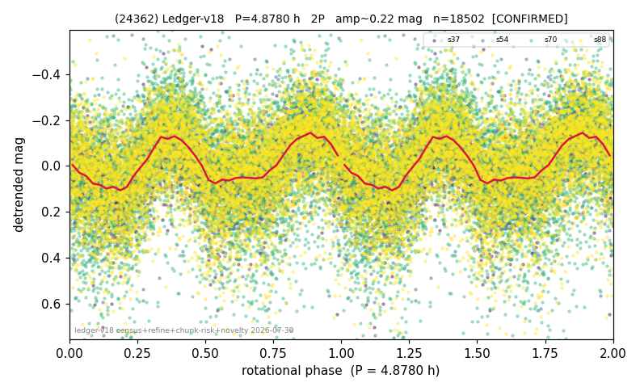

# (24362)

**Adopted:** 2.439 h, 1P, CONFIRMED

<!-- AUTO:START (regenerated from pipeline outputs; do not hand-edit this block) -->
## Evidence (auto)

Detected in 4 sector(s):

| sector | N | baseline (h) | P_phot (h) | power | FAP | cycles | flags |
|--|--|--|--|--|--|--|--|
| s37 | 2883 | 600.7 | 2.4389 | 0.2922 | 1.3e-211 | 123.1 | star-cleaned:3 |
| s54 | 1714 | 621.5 | 2.4406 | 0.2174 | 6.0e-87 | 254.6 | star-cleaned:29,2P-ambiguous |
| s70 | 5625 | 600.9 | 2.4392 | 0.1684 | 2.2e-220 | 246.4 | star-cleaned:104,2P-ambiguous |
| s88 | 8323 | 595.7 | 2.4385 | 0.1732 | 0.0e+00 | 244.3 | star-cleaned:17,2P-ambiguous |

- Pipeline refine said: **1P** (folded amp_fourier 0.27); flags: sick-dips-excised:s37(2),s54(1),s70(15),s88(6)
- DIA (de-comb): not triggered (clean, fast, non-comb)
- Gates: FAP<1e-3 and power>=0.10 per detecting sector; >=2 sectors agree (harmonic-aware).
- Adopted shape: **1P** (folded-amplitude rule; pipeline agrees).

### Why this row reads the way it does

- 4 sector(s) detecting
- cross-sector fold correlation 0.91
- single-peaked at folded amp 0.270 mag

<!-- AUTO:END -->
