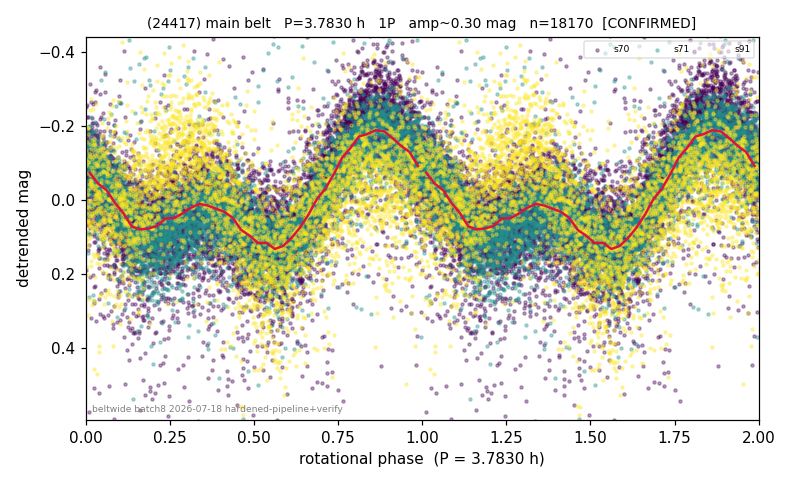

# (24417)

**Adopted:** 3.783 h, 1P, CONFIRMED

<!-- AUTO:START (regenerated from pipeline outputs; do not hand-edit this block) -->
## Evidence (auto)

Detected in 3 sector(s):

| sector | N | baseline (h) | P_phot (h) | power | FAP | cycles | flags |
|--|--|--|--|--|--|--|--|
| s70 | 8439 | 582.9 | 3.7833 | 0.3972 | 0.0e+00 | 154.1 | star-cleaned:124,2P-ambiguous |
| s71 | 5886 | 415.6 | 3.7829 | 0.4534 | 0.0e+00 | 109.9 | star-cleaned:94,2P-ambiguous |
| s91 | 3923 | 409.9 | 1.8916 | 0.2168 | 3.4e-203 | 108.3 | clean |

- Refined shape: **1P** (folded amp_fourier 0.238); flags: sector-dropped:s70(range>3mag);sick-dips-excised:s71(19),s91(2);period-spread:67%
- DIA (de-comb): survived(dPW=-0%,R2=0.01,s71@3.783h,7sec)
- Gates: FAP<1e-3 and power>=0.10 per detecting sector; >=2 sectors agree (harmonic-aware); folded-amplitude rule -> 1P.

<!-- AUTO:END -->
