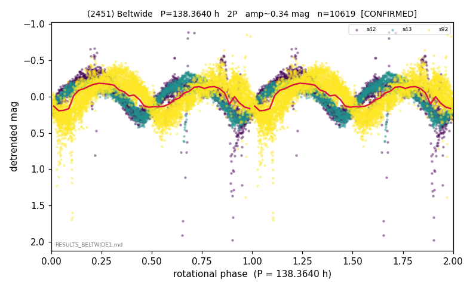

# (2451)

**Adopted:** 138.364 h, 2P, CONFIRMED

<!-- AUTO:START (regenerated from pipeline outputs; do not hand-edit this block) -->
## Evidence (auto)

Detected in 3 sector(s):

| sector | N | baseline (h) | P_phot (h) | power | FAP | cycles | flags |
|--|--|--|--|--|--|--|--|
| s42 | 2576 | 606.4 | 69.042 | 0.6798 | 0.0e+00 | 8.8 | star-cleaned:31,2P-ambiguous |
| s43 | 2443 | 569.9 | 69.1823 | 0.7791 | 0.0e+00 | 8.2 | 2P-ambiguous |
| s92 | 5600 | 431.2 | 69.2182 | 0.6262 | 0.0e+00 | 6.2 | star-cleaned:4,2P-ambiguous |

- Refined shape: **2P** (folded amp_fourier 0.545); flags: gap-alias-risk:102h;sick-dips-excised:s42(16),s92(4)
- DIA (de-comb): survived(dPW=+5%,R2=0.29,s43@69.182h,4sec)
- Gates: FAP<1e-3 and power>=0.10 per detecting sector; >=2 sectors agree (harmonic-aware); folded-amplitude rule -> 2P.

<!-- AUTO:END -->
