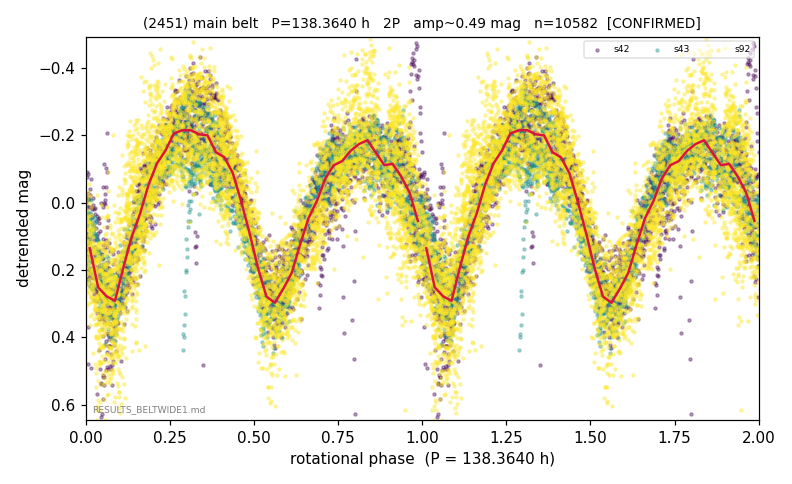

# (2451)

**Adopted:** 138.364 h, 2P, CONFIRMED

<!-- AUTO:START (regenerated from pipeline outputs; do not hand-edit this block) -->
## Evidence (auto)

Detected in 3 sector(s):

| sector | N | baseline (h) | P_phot (h) | power | FAP | cycles | flags |
|--|--|--|--|--|--|--|--|
| s42 | 2576 | 606.4 | 69.042 | 0.6798 | 0.0e+00 | 8.8 | star-cleaned:31,2P-ambiguous |
| s43 | 2443 | 569.9 | 69.1823 | 0.7791 | 0.0e+00 | 8.2 | 2P-ambiguous |
| s92 | 5600 | 431.2 | 69.2182 | 0.6262 | 0.0e+00 | 6.2 | star-cleaned:4,2P-ambiguous |

- Pipeline refine said: **2P** (folded amp_fourier 0.545); flags: gap-alias-risk:102h;sick-dips-excised:s42(16),s92(4)
- DIA (de-comb): survived(dPW=+5%,R2=0.29,s43@69.182h,4sec)
- Coverage: **3 sector(s)**, best sector covers **4.38 cycles** of the adopted period. Measured periodogram peak width 9% of the period, i.e. about **+/- 2.653 h** (1 sigma); the decimal places in the adopted value are not a precision claim.
- Factor of two: **confirmed against an independently published determination** (stronger than any internal test).
- Gates: FAP<1e-3 and power>=0.10 per detecting sector; >=2 sectors agree (harmonic-aware).
- Adopted shape: **2P** (folded-amplitude rule; pipeline agrees).

### Why this row reads the way it does

- SETTLES 3-way conflict: base 69.1-69.2h in ALL 3 sectors; refutes LCDB 48.0h AND Lam+2023 3.29h
- SPHEREx QR2 independent-epoch verification (2026-08-09, METHODOLOGY 6d): rotational modulation recovered at ~17 sigma across 37 clean reflected epochs with phase PREDICTED from the contemporaneous TESS s92 (zero free phase parameters), amplitude 0.90x TESS; de-rotated reflectance shows the 1-micron silicate band of its published S class (Mahlke+2022). Joint period refinement pending alias check: the sparse-epoch comb prefers 134.16 h at low scaled significance, but the 69.15 h photometric base is reproduced in all three TESS sectors, which disfavours that alias; adopted value unchanged

<!-- AUTO:END -->
