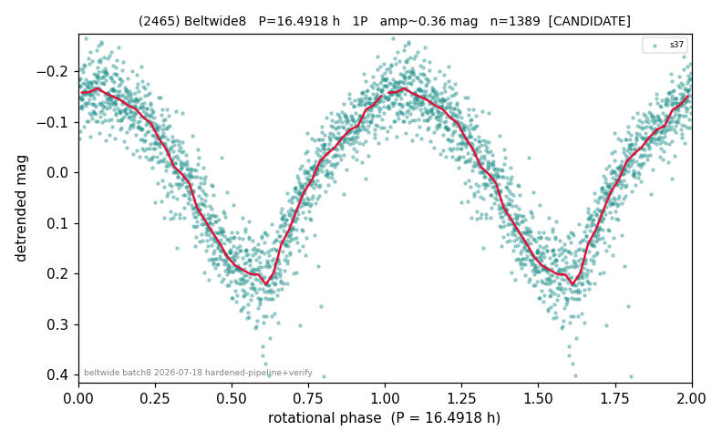

# (2465)

**Adopted:** 16.4918 h, 1P, CANDIDATE

<!-- AUTO:START (regenerated from pipeline outputs; do not hand-edit this block) -->
## Evidence (auto)

Detected in 1 sector(s):

| sector | N | baseline (h) | P_phot (h) | power | FAP | cycles | flags |
|--|--|--|--|--|--|--|--|
| s37 | 1389 | 296.0 | 16.4918 | 0.8623 | 0.0e+00 | 17.9 | 2P-ambiguous |

- Pipeline refine said: **1P** (folded amp_fourier 0.366); flags: near-threshold:0.37
- DIA (de-comb): not triggered (clean, fast, non-comb)
- Gates: FAP<1e-3 and power>=0.10 per detecting sector; single strong sector (candidate ceiling).
- Adopted shape: **1P** (folded-amplitude rule; pipeline agrees).

### Why this row reads the way it does

- REVIEW-FLAG: folded_amp=0.359. Only sector s37 exists (single sector -> CANDIDATE ceiling per house rules); independent LS reproduces P=16.491h with power 0.86/FAP~0, not a 328.8/24h-family comb tooth (13.7h fundamental, 16.49/13.7 not a simple ratio)

<!-- AUTO:END -->

## Reasoning
Single sector s37 (CANDIDATE ceiling); LS reproduces 16.491 h (power 0.86). Folded amp 0.359 -- BORDERLINE just under 0.40; ridge single-min so 1P held.
## Verdict
CANDIDATE 1P / 16.4918 h. Watch: a 2nd sector could flip it to 2P.
