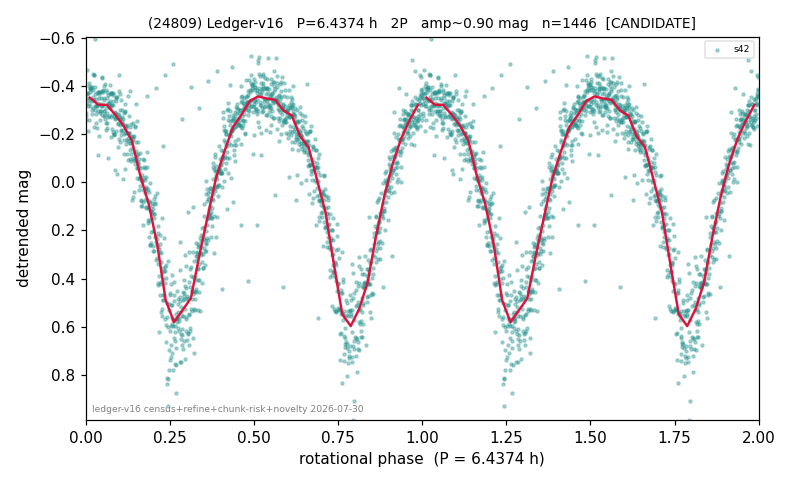

# (24809)

**Adopted:** 6.4374 h, 2P, CANDIDATE

<!-- AUTO:START (regenerated from pipeline outputs; do not hand-edit this block) -->
## Evidence (auto)

Detected in 1 sector(s):

| sector | N | baseline (h) | P_phot (h) | power | FAP | cycles | flags |
|--|--|--|--|--|--|--|--|
| s42 | 1451 | 310.4 | 3.2187 | 0.8226 | 0.0e+00 | 96.4 | 2P-ambiguous |

- Pipeline refine said: **2P** (folded amp_fourier 0.909); flags: sick-dips-excised:s42(5)
- DIA (de-comb): survived(dPW=+0%,R2=0.06,s42@3.219h,2sec)
- Gates: FAP<1e-3 and power>=0.10 per detecting sector; single strong sector (candidate ceiling).
- Adopted shape: **2P** (folded-amplitude rule; pipeline agrees).

### Why this row reads the way it does

- 1 sector(s) detecting
- doubling BY CONVENTION: amplitude rule on folded amp 0.909 mag, not individually audited

<!-- AUTO:END -->
