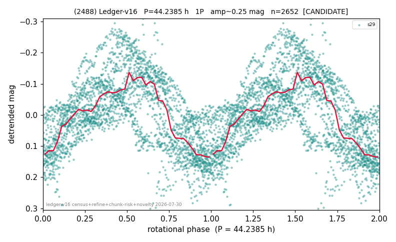

# (2488)

**Adopted:** 44.2385 h, 1P, CANDIDATE

<!-- AUTO:START (regenerated from pipeline outputs; do not hand-edit this block) -->
## Evidence (auto)

Detected in 1 sector(s):

| sector | N | baseline (h) | P_phot (h) | power | FAP | cycles | flags |
|--|--|--|--|--|--|--|--|
| s29 | 2653 | 584.3 | 44.2385 | 0.4811 | 0.0e+00 | 13.2 | star-cleaned:9,2P-ambiguous |

- Pipeline refine said: **1P** (folded amp_fourier 0.253); flags: clean
- DIA (de-comb): survived_v2(ret=0.967[0.95-0.98],s29@44.239h)
- Coverage: **1 sector(s)**, best sector covers **13.21 cycles** of the adopted period. Measured periodogram peak width 7% of the period, i.e. about **+/- 1.243 h** (1 sigma); the decimal places in the adopted value are not a precision claim.
- Factor of two: no doubling was applied.
- Gates: FAP<1e-3 and power>=0.10 per detecting sector; single strong sector (candidate ceiling).
- Adopted shape: **1P** (folded-amplitude rule; pipeline agrees).

### Why this row reads the way it does

- 1 sector(s) detecting
- single-peaked at folded amp 0.253 mag

<!-- AUTO:END -->
