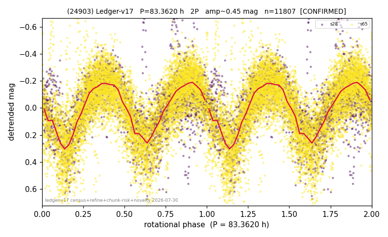

# (24903)

**Adopted:** 83.362 h, 2P, CONFIRMED

<!-- AUTO:START (regenerated from pipeline outputs; do not hand-edit this block) -->
## Evidence (auto)

Detected in 3 sector(s):

| sector | N | baseline (h) | P_phot (h) | power | FAP | cycles | flags |
|--|--|--|--|--|--|--|--|
| s28 | 2932 | 605.7 | 41.5579 | 0.4217 | 0.0e+00 | 14.6 | star-cleaned:20,2P-ambiguous |
| s45 | 2566 | 594.0 | 41.7402 | 0.4242 | 1.3e-302 | 14.2 | star-cleaned:10,2P-ambiguous |
| s65 | 8982 | 655.8 | 41.8045 | 0.5072 | 0.0e+00 | 15.7 | star-cleaned:25,2P-ambiguous |

- Pipeline refine said: **2P** (folded amp_fourier 0.467); flags: near-comb(amp-cleared):n=4,8;sick-dips-excised:s28(18),s65(26)
- DIA (de-comb): survived_v2(ret=0.993[0.99-0.99],s65@41.681h)
- Coverage: **3 sector(s)**, best sector covers **7.87 cycles** of the adopted period. Measured periodogram peak width 6% of the period, i.e. about **+/- 1.032 h** (1 sigma); the decimal places in the adopted value are not a precision claim.
- Factor of two: **adopted on the amplitude convention**: standard practice for an elongated body, but a convention rather than a measurement.
- Gates: FAP<1e-3 and power>=0.10 per detecting sector; >=2 sectors agree (harmonic-aware).
- Adopted shape: **2P** (folded-amplitude rule; pipeline agrees).

### Why this row reads the way it does

- 2 sector(s) detecting
- cross-sector fold correlation 0.97
- doubling BY CONVENTION: amplitude rule on folded amp 0.467 mag, not individually audited

<!-- AUTO:END -->
