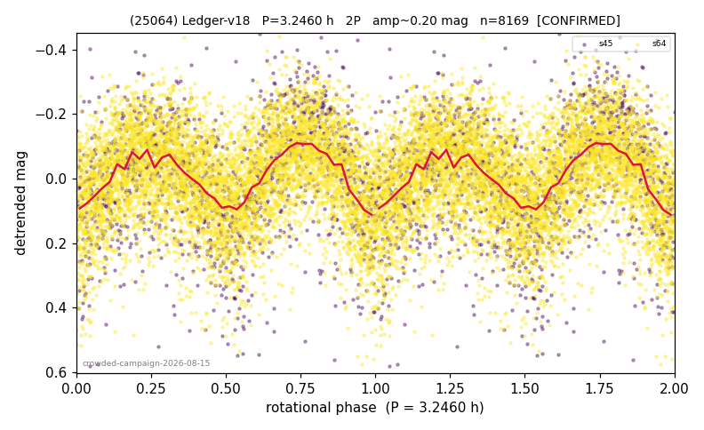

# (25064)

**Adopted:** 3.246 h, 2P, CONFIRMED

<!-- AUTO:START (regenerated from pipeline outputs; do not hand-edit this block) -->
## Evidence (auto)

Detected in 2 sector(s):

| sector | N | baseline (h) | P_phot (h) | power | FAP | cycles | flags |
|--|--|--|--|--|--|--|--|
| s45 | 1630 | 378.5 | 1.6236 | 0.1582 | 7.5e-57 | 233.1 | star-cleaned:40,2P-ambiguous |
| s64 | 6573 | 455.5 | 1.6226 | 0.1711 | 8.7e-263 | 280.7 | star-cleaned:5,2P-ambiguous |

- Pipeline refine said: **1P** (folded amp_fourier 0.189); flags: sick-dips-excised:s64(4)
- DIA (de-comb): survived(dPW=-0%,R2=0.00,s64@1.623h,1sec)
- Coverage: **2 sector(s)**, best sector covers **140.33 cycles** of the adopted period. Measured periodogram peak width 0% of the period, i.e. about **+/- 0.002533 h** (1 sigma); the decimal places in the adopted value are not a precision claim.
- Factor of two: PHYSICS.
- Gates: FAP<1e-3 and power>=0.10 per detecting sector; >=2 sectors agree (harmonic-aware).
- **Adopted shape 2P OVERRIDES the pipeline's 1P** (doubling audit 2026-07-25: folded amplitude >= 0.25 mag, so a single-peaked curve is physically implausible; Harris convention -> 2P. The census 3-test doubling logic was measured at only 30% recall against 289 LCDB U>=2 ground-truth periods).

### Why this row reads the way it does

- crowded-field campaign, adversarial review 2026-08-15: signal real (2/2 own peaks at 1.6230h, 24h/15 alias at 1.4% but common-mode clean 0%), census 1P=1.623h REJECTED: below the ~2.2h rubble-pile spin barrier for a km-scale MBA (amp up to 0.355) -> adopted at 2P
- shape by physical argument (precedent: 2124)

<!-- AUTO:END -->

## Reasoning
Adopted at 3.246 h = 2x the census period. The census 1P at 1.623 h sits below the ~2.2 h cohesionless spin barrier for a km-scale main-belt asteroid while the amplitude (up to 0.355 mag) implies real elongation: a strengthless body cannot do both, so the single-period reading is unphysical and 2P is adopted (precedent: 2124). Detection solid: 2/2 sectors peak at 1.6230 h, 24h/15 alias at 1.4% but common-mode field test clean (0% of field objects pass at this frequency).
## Verdict
CONFIRMED 2P / 3.246 h.
