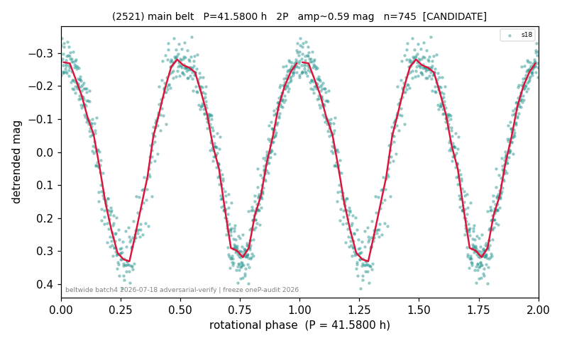

# (2521)

**Adopted:** 41.58 h, 2P, CANDIDATE

<!-- AUTO:START (regenerated from pipeline outputs; do not hand-edit this block) -->
## Evidence (auto)

Detected in 1 sector(s):

| sector | N | baseline (h) | P_phot (h) | power | FAP | cycles | flags |
|--|--|--|--|--|--|--|--|
| s18 | 745 | 569.0 | 20.7891 | 0.952 | 0.0e+00 | 27.4 | 2P-ambiguous |

- Refined shape: **2P** (folded amp_fourier 0.618); flags: near-comb(amp-cleared):n=8;gap-alias-risk:81h
- DIA (de-comb): survived(dPW=+4%,R2=0.16,s18@20.789h,1sec)
- Gates: FAP<1e-3 and power>=0.10 per detecting sector; single strong sector (candidate ceiling); folded-amplitude rule -> 2P.

<!-- AUTO:END -->
