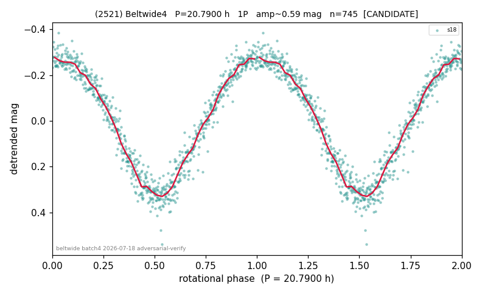

# (2521)

**Adopted:** 41.58 h, 2P, CANDIDATE

<!-- AUTO:START (regenerated from pipeline outputs; do not hand-edit this block) -->
## Evidence (auto)

Detected in 1 sector(s):

| sector | N | baseline (h) | P_phot (h) | power | FAP | cycles | flags |
|--|--|--|--|--|--|--|--|
| s18 | 745 | 569.0 | 20.7891 | 0.952 | 0.0e+00 | 27.4 | 2P-ambiguous |

- Pipeline refine said: **2P** (folded amp_fourier 0.618); flags: near-comb(amp-cleared):n=8;gap-alias-risk:81h
- DIA (de-comb): survived_v2(ret=0.995[0.99-1.00],s18@20.789h)
- Coverage: **1 sector(s)**, best sector covers **13.68 cycles** of the adopted period. Measured periodogram peak width 3% of the period, i.e. about **+/- 0.2735 h** (1 sigma); the decimal places in the adopted value are not a precision claim.
- Factor of two: **adopted on the amplitude convention**: standard practice for an elongated body, but a convention rather than a measurement.
- Gates: FAP<1e-3 and power>=0.10 per detecting sector; single strong sector (candidate ceiling).
- Adopted shape: **2P** (folded-amplitude rule; pipeline agrees).

### Why this row reads the way it does

- DOUBLED at freeze audit 2026-07-19: folded amp 0.587>0.40 -> 2P per house rule (batch4 verify predated the standard oneP audit; base 20.79h solid, ZTF promotion had failed). Single-sector s18, CANDIDATE cap.

<!-- AUTO:END -->
