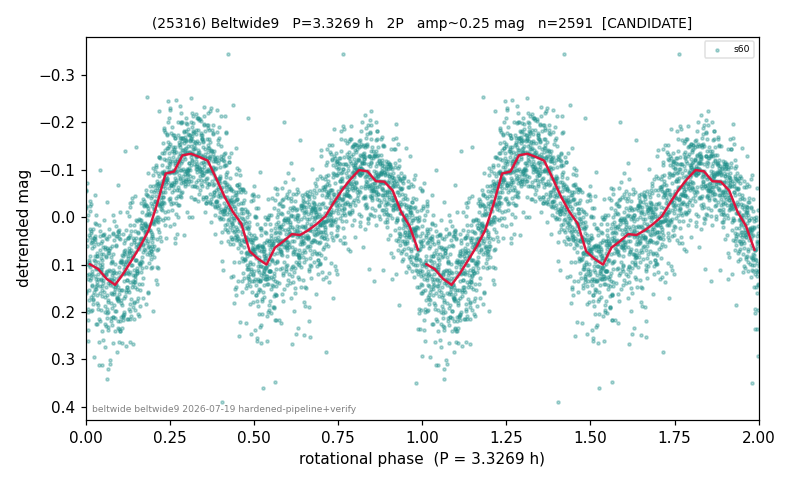

# (25316)

**Adopted:** 3.3269 h, 2P, CANDIDATE

<!-- AUTO:START (regenerated from pipeline outputs; do not hand-edit this block) -->
## Evidence (auto)

Detected in 1 sector(s):

| sector | N | baseline (h) | P_phot (h) | power | FAP | cycles | flags |
|--|--|--|--|--|--|--|--|
| s60 | 2591 | 176.6 | 1.6634 | 0.5707 | 0.0e+00 | 106.1 | 2P-ambiguous |

- Pipeline refine said: **1P** (folded amp_fourier 0.246); flags: clean
- DIA (de-comb): not triggered (the object is clean, fast and non-comb, so the test does not apply)
- Coverage: **1 sector(s)**, best sector covers **53.07 cycles** of the adopted period. Measured periodogram peak width 1% of the period, i.e. about **+/- 0.006306 h** (1 sigma); the decimal places in the adopted value are not a precision claim.
- Factor of two: PHYSICS.
- Gates: FAP<1e-3 and power>=0.10 per detecting sector; single strong sector (candidate ceiling).
- **Adopted shape 2P OVERRIDES the pipeline's 1P.** The catalog shape is a deliberate call, not the census default; what supports it for this object is the factor-of-two line above and the note at the end of this block (METHODOLOGY 3b). The census 3-test doubling logic was measured at only 30% recall against 289 LCDB U>=2 ground-truth periods, which is why it is overridden rather than followed.

### Why this row reads the way it does

- folded_amp=0.226. SPIN-BARRIER FORCED 2P: P_phot=1.6634h single-sector s60 (FAP~0), D=7.9km cannot spin sub-barrier -> 3.3269h/2P. Single-sector cap; REVIEW-FLAG spin-barrier override.

<!-- AUTO:END -->
