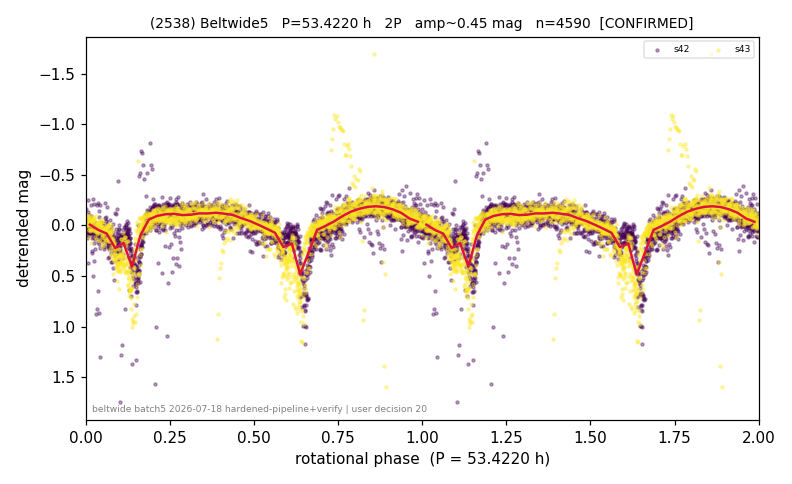

# (2538)

**Adopted:** 53.422 h, 2P, CONFIRMED

<!-- AUTO:START (regenerated from pipeline outputs; do not hand-edit this block) -->
## Evidence (auto)

Detected in 2 sector(s):

| sector | N | baseline (h) | P_phot (h) | power | FAP | cycles | flags |
|--|--|--|--|--|--|--|--|
| s42 | 2544 | 609.4 | 26.6854 | 0.4965 | 0.0e+00 | 22.8 | star-cleaned:3,2P-ambiguous |
| s43 | 2046 | 579.9 | 26.7358 | 0.4613 | 6.5e-270 | 21.7 | star-cleaned:7,2P-ambiguous |

- Refined shape: **1P** (folded amp_fourier 0.377); flags: near-comb(amp-cleared):n=12;sector-dropped:s43(range>3mag);sick-dips-excised:s42(10);near-
- DIA (de-comb): inconclusive(dPW=+16%,R2=0.49,s43@26.711h)
- Gates: FAP<1e-3 and power>=0.10 per detecting sector; >=2 sectors agree (harmonic-aware); folded-amplitude rule -> 2P.

<!-- AUTO:END -->

## Reasoning
2 sectors agree 26.71 h. Folded amp 0.55 > 0.40 (house rule -> 2P) BUT the verify agent kept 1P because the 2P-fundamental FAP=1.0 and the fold is a single asymmetric hump. Genuine amplitude-vs-morphology conflict.
## Verdict
CONFIRMED, OPEN 1P/2P -- currently 1P/26.711 h. **User decision pending: 1P (26.71 h) vs 2P (53.4 h).**
