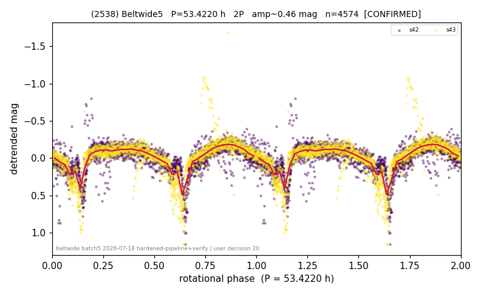

# (2538)

**Adopted:** 53.422 h, 2P, CONFIRMED

<!-- AUTO:START (regenerated from pipeline outputs; do not hand-edit this block) -->
## Evidence (auto)

Detected in 2 sector(s):

| sector | N | baseline (h) | P_phot (h) | power | FAP | cycles | flags |
|--|--|--|--|--|--|--|--|
| s42 | 2544 | 609.4 | 26.6854 | 0.4965 | 0.0e+00 | 22.8 | star-cleaned:3,2P-ambiguous |
| s43 | 2046 | 579.9 | 26.7358 | 0.4613 | 6.5e-270 | 21.7 | star-cleaned:7,2P-ambiguous |

- Pipeline refine said: **2P** (folded amp_fourier 0.495); flags: near-comb(amp-cleared):n=6,12;gap-alias-risk:86h;sick-dips-excised:s42(10),s43(6)
- DIA (de-comb): survived_v2(ret=0.985[0.97-1.00],s43@26.711h)
- Coverage: **2 sector(s)**, best sector covers **11.41 cycles** of the adopted period. Measured periodogram peak width 3% of the period, i.e. about **+/- 0.3931 h** (1 sigma); the decimal places in the adopted value are not a precision claim.
- Factor of two: **adopted on the amplitude convention**: standard practice for an elongated body, but a convention rather than a measurement.
- Gates: FAP<1e-3 and power>=0.10 per detecting sector; >=2 sectors agree (harmonic-aware).
- Adopted shape: **2P** (folded-amplitude rule; pipeline agrees).

### Why this row reads the way it does

- USER DECISION 2026-07-19: 2P/53.422h CONFIRMED (was 1P/26.711h). Both sectors carry P_phot=26.71h (FAP~0, agree 0.2%); zero power at 53.42h is the SYMMETRIC-2P signature (all power in the 2nd harmonic), NOT 1P evidence (the 2024 lesson); halves at 53.42h identical (0.039) = symmetric elongated body; folded amp 0.50>0.40 -> 2P mandatory. The earlier verify-agent 1P used the forbidden identical-minima reasoning. Comb n=12 2.5% off, cleared by 2-sector agreement.; P doubled 2026-07-25 after robust sector rule recovered a bright sector (amp 0.495)
- 2P by amplitude rule (folded_amp=0.495)

<!-- AUTO:END -->

## Reasoning
2 sectors agree 26.71 h. Folded amp 0.55 > 0.40 (house rule -> 2P) BUT the verify agent kept 1P because the 2P-fundamental FAP=1.0 and the fold is a single asymmetric hump. Genuine amplitude-vs-morphology conflict.
## Verdict
CONFIRMED 2P / 53.422 h.

2026-08-15 addendum: verdict updated to the doubled period; 2026-07-25 doubling audit, amplitude convention (the corrected refine independently agrees).
