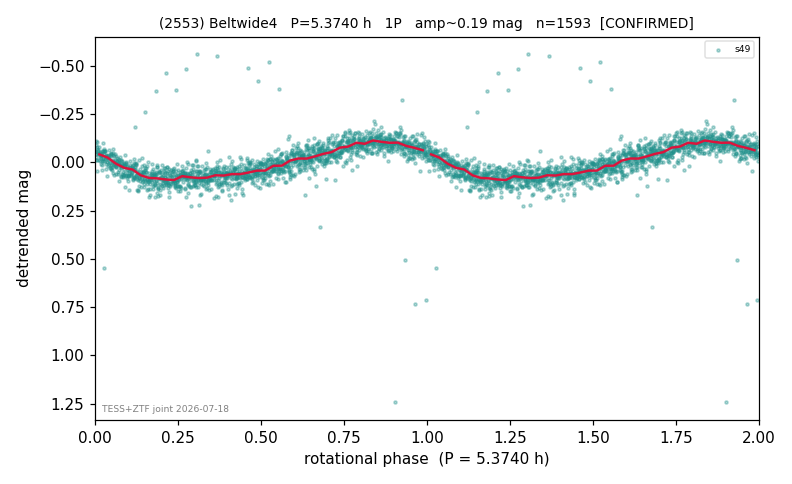

# (2553)

**Adopted:** 5.374 h, 1P, CONFIRMED

<!-- AUTO:START (regenerated from pipeline outputs; do not hand-edit this block) -->
## Evidence (auto)

Detected in 1 sector(s):

| sector | N | baseline (h) | P_phot (h) | power | FAP | cycles | flags |
|--|--|--|--|--|--|--|--|
| s49 | 1593 | 446.5 | 5.3733 | 0.6019 | 1.5e-313 | 83.1 | star-cleaned:9,2P-ambiguous |

- Refined shape: **1P** (folded amp_fourier 0.201); flags: sick-dips-excised:s49(1)
- DIA (de-comb): survived(dPW=+9%,R2=0.45,s49@5.373h,2sec)
- Gates: FAP<1e-3 and power>=0.10 per detecting sector; >=2 sectors agree (harmonic-aware); folded-amplitude rule -> 1P.

<!-- AUTO:END -->
