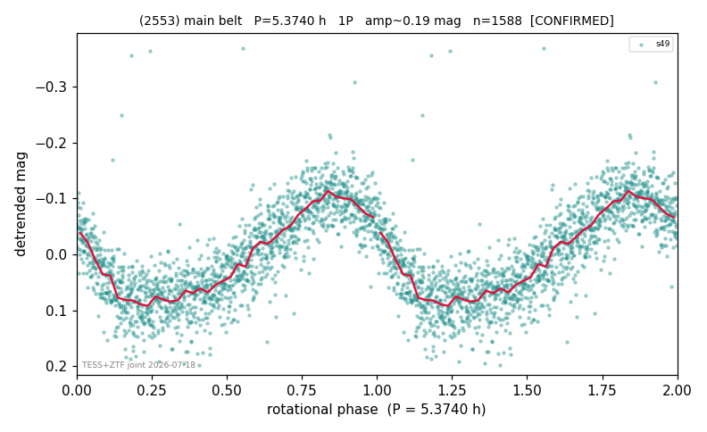

# (2553)

**Adopted:** 5.374 h, 1P, CONFIRMED

<!-- AUTO:START (regenerated from pipeline outputs; do not hand-edit this block) -->
## Evidence (auto)

Detected in 1 sector(s):

| sector | N | baseline (h) | P_phot (h) | power | FAP | cycles | flags |
|--|--|--|--|--|--|--|--|
| s49 | 1593 | 446.5 | 5.3733 | 0.6019 | 1.5e-313 | 83.1 | star-cleaned:9,2P-ambiguous |

- Pipeline refine said: **1P** (folded amp_fourier 0.201); flags: sick-dips-excised:s49(1)
- DIA (de-comb): survived(dPW=+9%,R2=0.45,s49@5.373h,2sec)
- Coverage: **1 sector(s)**, best sector covers **83.09 cycles** of the adopted period. Measured periodogram peak width 1% of the period, i.e. about **+/- 0.02 h** (1 sigma); the decimal places in the adopted value are not a precision claim.
- Factor of two: no doubling was applied.
- Gates: FAP<1e-3 and power>=0.10 per detecting sector; >=2 sectors agree (harmonic-aware).
- Adopted shape: **1P** (folded-amplitude rule; pipeline agrees).

### Why this row reads the way it does

- ZTF blind top-1 recovery FAP 2.8e-93 (+0.04%)

<!-- AUTO:END -->
