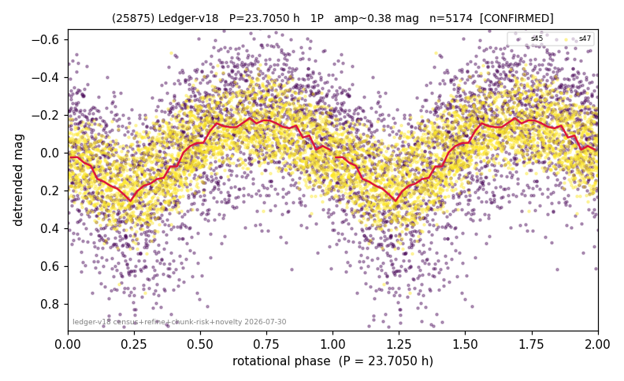

# (25875)

**Adopted:** 23.705 h, 1P, CONFIRMED

<!-- AUTO:START (regenerated from pipeline outputs; do not hand-edit this block) -->
## Evidence (auto)

Detected in 2 sector(s):

| sector | N | baseline (h) | P_phot (h) | power | FAP | cycles | flags |
|--|--|--|--|--|--|--|--|
| s45 | 2536 | 581.5 | 23.7091 | 0.2767 | 1.1e-173 | 24.5 | star-cleaned:11,2P-ambiguous |
| s47 | 2667 | 642.3 | 23.7008 | 0.4249 | 1.9e-315 | 27.1 | star-cleaned:11,2P-ambiguous |

- Pipeline refine said: **1P** (folded amp_fourier 0.335); flags: amp-from-clean-sectors(ignored s45);near-comb(amp-cleared):n=14;sick-dips-excised:s45(4),s
- DIA (de-comb): survived_v2(ret=0.990[0.99-0.99],s47@23.705h)
- Coverage: **2 sector(s)**, best sector covers **27.1 cycles** of the adopted period. Measured periodogram peak width 3% of the period, i.e. about **+/- 0.3013 h** (1 sigma); the decimal places in the adopted value are not a precision claim.
- Factor of two: no doubling was applied.
- Gates: FAP<1e-3 and power>=0.10 per detecting sector; >=2 sectors agree (harmonic-aware).
- Adopted shape: **1P** (folded-amplitude rule; pipeline agrees).

### Why this row reads the way it does

- 2 sector(s) detecting
- cross-sector fold correlation 0.92
- single-peaked at folded amp 0.335 mag

<!-- AUTO:END -->
