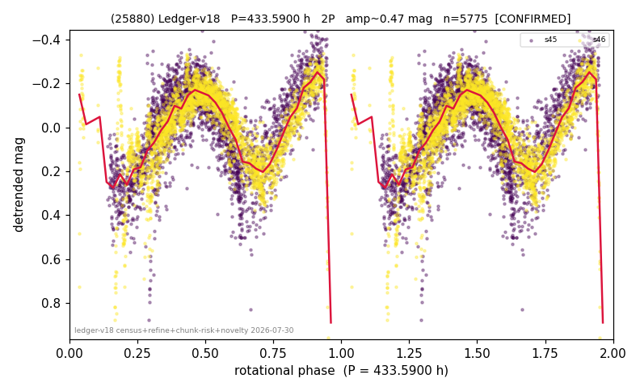

# (25880)

**Adopted:** 433.59 h, 2P, CONFIRMED

<!-- AUTO:START (regenerated from pipeline outputs; do not hand-edit this block) -->
## Evidence (auto)

Detected in 2 sector(s):

| sector | N | baseline (h) | P_phot (h) | power | FAP | cycles | flags |
|--|--|--|--|--|--|--|--|
| s45 | 2804 | 586.2 | 215.4022 | 0.6344 | 0.0e+00 | 2.7 | phase-curve-risk,2P-untestable,2P-ambigu |
| s46 | 2984 | 625.5 | 218.1874 | 0.5887 | 0.0e+00 | 2.9 | 2P-untestable,2P-ambiguous |

- Pipeline refine said: **2P** (folded amp_fourier 0.569); flags: few-cycle:1.4;gap-alias-risk:85h;sick-dips-excised:s45(5),s46(8);phase-curve-risk:1/2-sect
- DIA (de-comb): inconclusive(dPW=+16%,R2=0.35,s45@216.795h)
- Coverage: **2 sector(s)**, best sector covers **1.44 cycles** of the adopted period. Measured periodogram peak width 28% of the period, i.e. about **+/- 25.86 h** (1 sigma); the decimal places in the adopted value are not a precision claim.
- Factor of two: **measured on the data** (odd-harmonic power or unequal minima, significant and reproduced), METHODOLOGY 3b.
- Gates: FAP<1e-3 and power>=0.10 per detecting sector; >=2 sectors agree (harmonic-aware).
- Adopted shape: **2P** (folded-amplitude rule; pipeline agrees).

### Why this row reads the way it does

- 2 sector(s) detecting
- cross-sector fold correlation 0.79
- doubling MEASURED: odd-harmonic 4.17 sigma in s46 plus unequal minima there (z=7.3); the longest period in the programme and NOT chunk-extracted
- pipeline flag: few-cycle

<!-- AUTO:END -->
