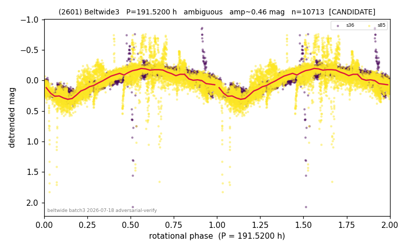

# (2601)

**Adopted:** 191.52 h, ambiguous, CANDIDATE

<!-- AUTO:START (regenerated from pipeline outputs; do not hand-edit this block) -->
## Evidence (auto)

Detected in 2 sector(s):

| sector | N | baseline (h) | P_phot (h) | power | FAP | cycles | flags |
|--|--|--|--|--|--|--|--|
| s36 | 2764 | 586.8 | 194.3789 | 0.7101 | 0.0e+00 | 3.0 | star-cleaned:26,2P-untestable,2P-ambiguo |
| s85 | 7949 | 596.0 | 189.1247 | 0.614 | 0.0e+00 | 3.2 | star-cleaned:90,2P-untestable,2P-ambiguo |

- Pipeline refine said: **2P** (folded amp_fourier 0.552); flags: few-cycle:1.6;sick-dips-excised:s36(5),s85(24)
- DIA (de-comb): survived(dPW=+5%,R2=0.03,s36@191.752h,6sec)
- Gates: FAP<1e-3 and power>=0.10 per detecting sector; single strong sector (candidate ceiling).
- **Adopted shape ambiguous OVERRIDES the pipeline's 2P** (doubling audit 2026-07-25: folded amplitude >= 0.25 mag, so a single-peaked curve is physically implausible; Harris convention -> ambiguous. The census 3-test doubling logic was measured at only 30% recall against 289 LCDB U>=2 ground-truth periods).

<!-- AUTO:END -->
