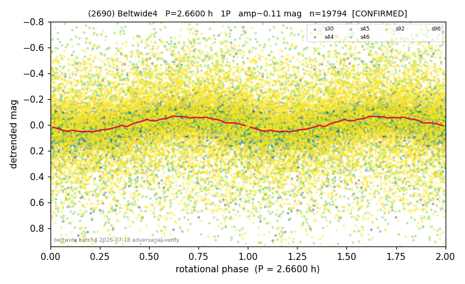

# (2690)

**Adopted:** 2.66 h, 1P, CONFIRMED

<!-- AUTO:START (regenerated from pipeline outputs; do not hand-edit this block) -->
## Evidence (auto)

Detected in 6 sector(s):

| sector | N | baseline (h) | P_phot (h) | power | FAP | cycles | flags |
|--|--|--|--|--|--|--|--|
| s30 | 2688 | 633.7 | 2.6589 | 0.3911 | 1.3e-284 | 238.3 | star-cleaned:21,2P-ambiguous |
| s44 | 1402 | 259.7 | 2.6615 | 0.1284 | 6.3e-38 | 97.6 | star-cleaned:28,2P-ambiguous |
| s45 | 2408 | 552.7 | 200.0147 | 0.1322 | 8.1e-70 | 2.8 | star-cleaned:44,phase-curve-risk,2P-unte |
| s46 | 3017 | 622.4 | 2.6588 | 0.216 | 9.4e-155 | 234.1 | star-cleaned:3,2P-ambiguous |
| s92 | 1946 | 143.4 | 2.6215 | 0.0243 | 8.2e-07 | 54.7 | clean |
| s96 | 8480 | 599.5 | 181.0448 | 0.0577 | 1.3e-104 | 3.3 | star-cleaned:93 |

- Pipeline refine said: **1P** (folded amp_fourier 0.175); flags: sick-dips-excised:s30(1),s44(8),s45(5),s46(5);harmonic-only-agreement:s45(pw=0.09);incoher
- DIA (de-comb): survived(dPW=-1%,R2=0.40,s30@2.659h,6sec)
- Coverage: **6 sector(s)**, best sector covers **238.22 cycles** of the adopted period. Measured periodogram peak width 0% of the period, i.e. about **+/- 0.0 h** (1 sigma); the decimal places in the adopted value are not a precision claim.
- Factor of two: no doubling was applied.
- Gates: FAP<1e-3 and power>=0.10 per detecting sector; >=2 sectors agree (harmonic-aware).
- Adopted shape: **1P** (folded-amplitude rule; pipeline agrees).

### Why this row reads the way it does

- 6 sectors, 1P; verify pending-batch resolved

<!-- AUTO:END -->
