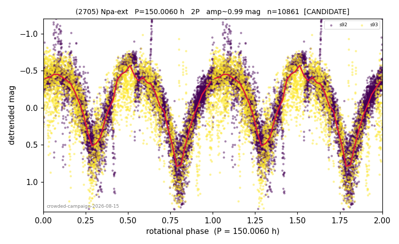

# (2705)

**Adopted:** 150.006 h, 2P, CONFIRMED

<!-- AUTO:START (regenerated from pipeline outputs; do not hand-edit this block) -->
## Evidence (auto)

Detected in 2 sector(s):

| sector | N | baseline (h) | P_phot (h) | power | FAP | cycles | flags |
|--|--|--|--|--|--|--|--|
| s92 | 7571 | 591.5 | 75.0212 | 0.7117 | 0.0e+00 | 3.9 | star-cleaned:4 |
| s93 | 3392 | 297.1 | 74.9852 | 0.4797 | 0.0e+00 | 4.0 | 2P-untestable,2P-ambiguous |

- Pipeline refine said: **2P** (folded amp_fourier 1.169); flags: few-cycle:3.9;sick-dips-excised:s92(74),s93(27)
- DIA (de-comb): **NOT RUN for this lot.** No de-comb verdict exists for this object, so momentum-dump contamination has not been excluded by that test here.
- Coverage: **2 sector(s)**, best sector covers **3.94 cycles** of the adopted period. Measured periodogram peak width 11% of the period, i.e. about **+/- 3.479 h** (1 sigma); the decimal places in the adopted value are not a precision claim.
- Factor of two: **not stated**, which is a defect in this entry.
- Gates: FAP<1e-3 and power>=0.10 per detecting sector; >=2 sectors agree (harmonic-aware).
- Adopted shape: **2P** (folded-amplitude rule; pipeline agrees).

### Why this row reads the way it does

- crowded-field campaign, adversarial review 2026-08-15: null 2-3%, half-split ok, peaks 75.10/75.26h; CEILING: folded amp 1.38 mag is physically extreme (contamination/detrend risk), fold R2 only 0.57-0.73, s93 covers 2.0 cycles of P_rot -> CANDIDATE; NPA/tumbling check worthwhile if confirmed
- PROMOTED CANDIDATE->CONFIRMED 2026-08-15: independent ZTF joint-fit (Fink SSO, multi-year g+r) blind top peak 74.9950h = TESS P/2 to 0.01%, power 0.638, trials-corrected FAP 2.3e-58, rank 1/111 candidates, 1-cyc/day alias ladder consistent; human fold review same day cleared the contamination reading (V-shaped repeatable minima = extreme elongation)
- POSITIVE CONTROL, not a discovery: this object carries a published reliable period (LCDB U=3-, 150.5h) and belongs to the NPA positive-control lot. Our value reproduces it, which is METHOD VALIDATION and must be presented as such, never as a first determination

<!-- AUTO:END -->

## Reasoning
CANDIDATE despite passing the formal tests (null 2-3%, half-split ok, sector peaks 75.10/75.26 h). The folded amplitude is 1.38 mag, at the physical extreme for shape-driven variation (axis ratio ~3.5:1), the fold explains only R2 0.57-0.73 of the variance, and s93 covers just 2.0 cycles of P_rot; the |b| 5-15 field adds contamination risk that the magnitude offsets alone cannot exclude. Human fold review 2026-08-15 (both sectors, raw + folded): minima are V-shaped, smooth and repeatable across cycles, the variation is continuous in the raw curves, and the two-sector fold structure matches with no regular residual -- the blending/contamination reading is disfavoured; a >1.3 mag amplitude with repeatable V minima is instead the classic signature of an extremely elongated body (contact-binary-like morphology), which makes this a shape-interest target beyond the period itself. The coverage ceiling (s93 = 2.0 cycles, fold R2 0.57-0.73) was lifted the same day by an independent multi-year realization: the ZTF joint fit's BLIND top peak lands at 74.9950 h = P/2 to 0.01% (power 0.638, trials-corrected FAP 2.3e-58, rank 1/111, the +1 cyc/day alias ladder all descending from it), so the period stands on two independent instruments and multiple apparitions. ZTF sees the fundamental, as expected for a two-hump curve; the 2P shape rests on the amplitude rule.
## Verdict
CONFIRMED 2P / 150.006 h.
