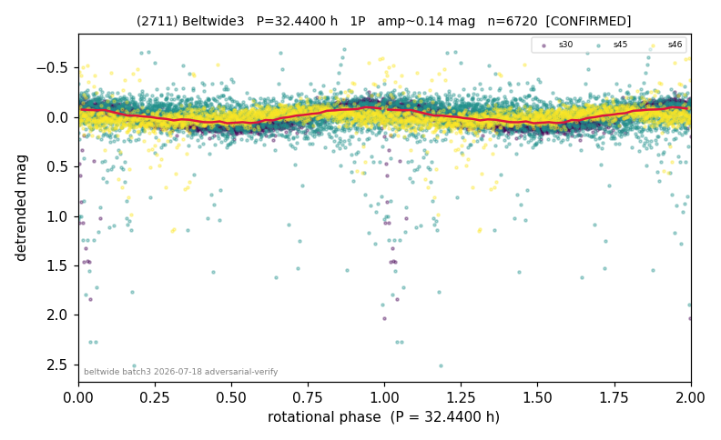

# (2711)

**Adopted:** 32.44 h, 1P, CONFIRMED

<!-- AUTO:START (regenerated from pipeline outputs; do not hand-edit this block) -->
## Evidence (auto)

Detected in 3 sector(s):

| sector | N | baseline (h) | P_phot (h) | power | FAP | cycles | flags |
|--|--|--|--|--|--|--|--|
| s30 | 2652 | 638.2 | 32.5946 | 0.7395 | 0.0e+00 | 19.6 | star-cleaned:22,2P-ambiguous |
| s45 | 2595 | 583.7 | 265.8236 | 0.133 | 5.1e-76 | 2.2 | star-cleaned:74,grid-edge,phase-curve-ri |
| s46 | 1473 | 284.8 | 32.2834 | 0.1459 | 1.8e-46 | 8.8 | star-cleaned:23,2P-ambiguous |

- Pipeline refine said: **1P** (folded amp_fourier 0.209); flags: dump-alias-suspect:n=10;sick-dips-excised:s30(4)
- DIA (de-comb): survived(dPW=-19%,R2=0.36,s30@32.439h,2sec)
- Coverage: **3 sector(s)**, best sector covers **19.67 cycles** of the adopted period. Measured periodogram peak width 5% of the period, i.e. about **+/- 0.6293 h** (1 sigma); the decimal places in the adopted value are not a precision claim.
- Factor of two: no doubling was applied.
- Gates: FAP<1e-3 and power>=0.10 per detecting sector; >=2 sectors agree (harmonic-aware).
- Adopted shape: **1P** (folded-amplitude rule; pipeline agrees).

### Why this row reads the way it does

- 2 apparitions s30/s46 agree <1%; minima symmetric->1P; comb 328.8/10 adjacent but S46 1.8% off

<!-- AUTO:END -->
