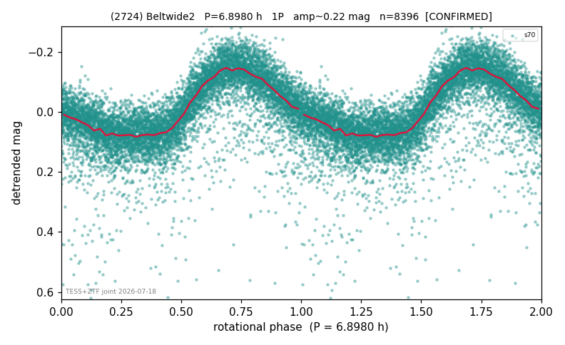

# (2724)

**Adopted:** 6.898 h, 1P, CONFIRMED

<!-- AUTO:START (regenerated from pipeline outputs; do not hand-edit this block) -->
## Evidence (auto)

Detected in 1 sector(s):

| sector | N | baseline (h) | P_phot (h) | power | FAP | cycles | flags |
|--|--|--|--|--|--|--|--|
| s70 | 8405 | 600.9 | 6.8986 | 0.5635 | 0.0e+00 | 87.1 | star-cleaned:63,2P-ambiguous |

- Pipeline refine said: **1P** (folded amp_fourier 0.242); flags: sick-dips-excised:s70(5)
- DIA (de-comb): survived(dPW=-13%,R2=0.12,s70@6.899h,3sec)
- Gates: FAP<1e-3 and power>=0.10 per detecting sector; >=2 sectors agree (harmonic-aware).
- Adopted shape: **1P** (folded-amplitude rule; pipeline agrees).

### Why this row reads the way it does

- TESS single-sector + ZTF independent blind-recovery (FAP<<1e-8) = 2nd realization. TESS sector 70 (8405 pts, 63 bright-star points clipped, 600.9h baseline, 87 cycles) gives

<!-- AUTO:END -->
