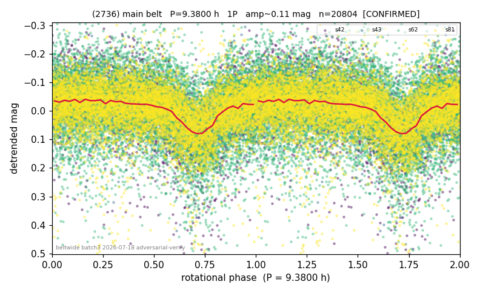

# (2736)

**Adopted:** 9.38 h, 1P, CONFIRMED

<!-- AUTO:START (regenerated from pipeline outputs; do not hand-edit this block) -->
## Evidence (auto)

Detected in 4 sector(s):

| sector | N | baseline (h) | P_phot (h) | power | FAP | cycles | flags |
|--|--|--|--|--|--|--|--|
| s42 | 2239 | 510.5 | 9.3755 | 0.1644 | 6.1e-83 | 54.5 | star-cleaned:115,2P-ambiguous |
| s43 | 1519 | 263.8 | 9.3688 | 0.2155 | 6.8e-76 | 28.2 | star-cleaned:15,2P-ambiguous |
| s62 | 8880 | 598.7 | 9.3903 | 0.0622 | 7.7e-119 | 63.8 | star-cleaned:9 |
| s81 | 8262 | 616.0 | 9.3969 | 0.1011 | 2.8e-186 | 65.5 | star-cleaned:147,2P-ambiguous |

- Refined shape: **1P** (folded amp_fourier 0.171); flags: sector-dropped:s81(range>3mag);sick-dips-excised:s42(3),s43(2)
- DIA (de-comb): survived(dPW=+0%,R2=0.02,s42@9.376h,7sec)
- Gates: FAP<1e-3 and power>=0.10 per detecting sector; >=2 sectors agree (harmonic-aware); folded-amplitude rule -> 1P.

<!-- AUTO:END -->
