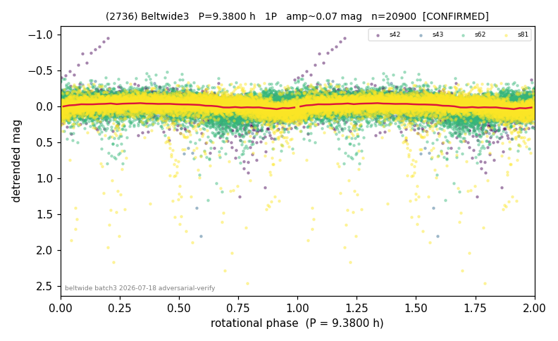

# (2736)

**Adopted:** 9.38 h, 1P, CONFIRMED

<!-- AUTO:START (regenerated from pipeline outputs; do not hand-edit this block) -->
## Evidence (auto)

Detected in 4 sector(s):

| sector | N | baseline (h) | P_phot (h) | power | FAP | cycles | flags |
|--|--|--|--|--|--|--|--|
| s42 | 2239 | 510.5 | 9.3755 | 0.1644 | 6.1e-83 | 54.5 | star-cleaned:115,2P-ambiguous |
| s43 | 1519 | 263.8 | 9.3688 | 0.2155 | 6.8e-76 | 28.2 | star-cleaned:15,2P-ambiguous |
| s62 | 8880 | 598.7 | 9.3903 | 0.0622 | 7.7e-119 | 63.8 | star-cleaned:9 |
| s81 | 8262 | 616.0 | 9.3969 | 0.1011 | 2.8e-186 | 65.5 | star-cleaned:147,2P-ambiguous |

- Pipeline refine said: **1P** (folded amp_fourier 0.171); flags: sick-dips-excised:s42(3),s43(2),s81(56);harmonic-only-agreement:s81(pw=0.05)
- DIA (de-comb): survived(dPW=+0%,R2=0.02,s42@9.376h,7sec)
- Coverage: **4 sector(s)**, best sector covers **65.67 cycles** of the adopted period. Measured periodogram peak width 1% of the period, i.e. about **+/- 0.0502 h** (1 sigma); the decimal places in the adopted value are not a precision claim.
- Factor of two: no doubling was applied.
- Gates: FAP<1e-3 and power>=0.10 per detecting sector; >=2 sectors agree (harmonic-aware).
- Adopted shape: **1P** (folded-amplitude rule; pipeline agrees).

### Why this row reads the way it does

- 4 sectors/3 apparitions agree 0.3%; folded amp 0.11-0.18 (raw 0.60 spurious)->1P

<!-- AUTO:END -->
