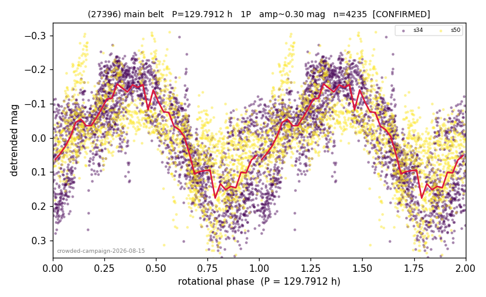

# (27396)

**Adopted:** 128.487 h, 1P, CANDIDATE

<!-- AUTO:START (regenerated from pipeline outputs; do not hand-edit this block) -->
## Evidence (auto)

Detected in 2 sector(s):

| sector | N | baseline (h) | P_phot (h) | power | FAP | cycles | flags |
|--|--|--|--|--|--|--|--|
| s34 | 2504 | 594.2 | 131.7215 | 0.6281 | 0.0e+00 | 4.5 | star-cleaned:13,2P-ambiguous |
| s50 | 1753 | 541.7 | 125.252 | 0.3946 | 2.4e-186 | 4.3 | star-cleaned:17,2P-ambiguous |

- Pipeline refine said: **1P** (folded amp_fourier 0.282); flags: few-cycle:2.2;gap-alias-risk:178h;sick-dips-excised:s50(8)
- DIA (de-comb): survived(dPW=+12%,R2=0.15,s50@125.252h,1sec)
- Coverage: **2 sector(s)**, best sector covers **4.62 cycles** of the adopted period. Measured periodogram peak width 19% of the period, i.e. about **+/- 10.49 h** (1 sigma); the decimal places in the adopted value are not a precision claim.
- Factor of two: no doubling was applied.
- Gates: FAP<1e-3 and power>=0.10 per detecting sector; single strong sector (candidate ceiling).
- Adopted shape: **1P** (folded-amplitude rule; pipeline agrees).

### Why this row reads the way it does

- crowded-field campaign, adversarial review 2026-08-15: half-split ok both sectors, peaks 130.7/126.7h; CEILING: null-calibrated gate loses power on s50 (5.5% false pass = red noise) and amp 0.281 ambiguous for 1P -> CANDIDATE until a cleaner epoch

<!-- AUTO:END -->

## Reasoning
CANDIDATE by one bar. Half-split stable in both sectors, peaks 130.7/126.7 h (agreement inside the expected peak width, so not independent evidence). The ceiling: on s50 the null-calibrated gate loses power (5.5% of random periods pass = red-noise floor at these frequencies), and the folded amplitude 0.281 is ambiguous for the 1P reading. The period is plausible but one of the two sectors cannot, on its own statistics, distinguish it from red noise.
## Verdict
CANDIDATE 1P / 128.487 h.
