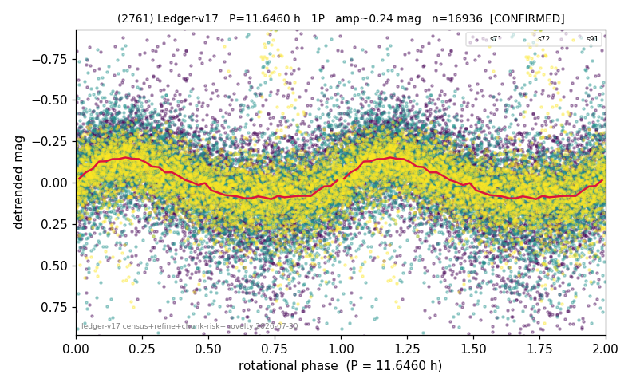

# (2761)

**Adopted:** 11.646 h, 1P, CONFIRMED

<!-- AUTO:START (regenerated from pipeline outputs; do not hand-edit this block) -->
## Evidence (auto)

Detected in 3 sector(s):

| sector | N | baseline (h) | P_phot (h) | power | FAP | cycles | flags |
|--|--|--|--|--|--|--|--|
| s71 | 7324 | 578.7 | 11.6414 | 0.1708 | 9.6e-293 | 49.7 | star-cleaned:63,2P-ambiguous |
| s72 | 7087 | 581.8 | 11.6464 | 0.2251 | 0.0e+00 | 50.0 | star-cleaned:208,2P-ambiguous |
| s91 | 4706 | 642.4 | 11.6666 | 0.2178 | 6.2e-246 | 55.1 | star-cleaned:126,2P-ambiguous |

- Pipeline refine said: **1P** (folded amp_fourier 0.302); flags: sick-dips-excised:s71(9),s72(8),s91(20)
- DIA (de-comb): survived(dPW=+0%,R2=0.02,s71@11.646h,4sec)
- Coverage: **3 sector(s)**, best sector covers **54.86 cycles** of the adopted period. Measured periodogram peak width 1% of the period, i.e. about **+/- 0.06233 h** (1 sigma); the decimal places in the adopted value are not a precision claim.
- Factor of two: no doubling was applied.
- Gates: FAP<1e-3 and power>=0.10 per detecting sector; >=2 sectors agree (harmonic-aware).
- Adopted shape: **1P** (folded-amplitude rule; pipeline agrees).

### Why this row reads the way it does

- 3 sector(s) detecting
- cross-sector fold correlation 0.95
- single-peaked at folded amp 0.302 mag
- chunked sectors flagged (BROKEN_CHUNK;AMP_DOMINATED;direct-sector-supported) but a directly extracted sector carries the period
- chunk-extracted sectors re-extracted DIRECTLY 2026-08-06: power at the adopted period retained (s71 0.137->0.124, s72 0.134->0.126, s91 0.124->0.093); the direct curves are now the published ones, so this period no longer rests on chunked photometry

<!-- AUTO:END -->
