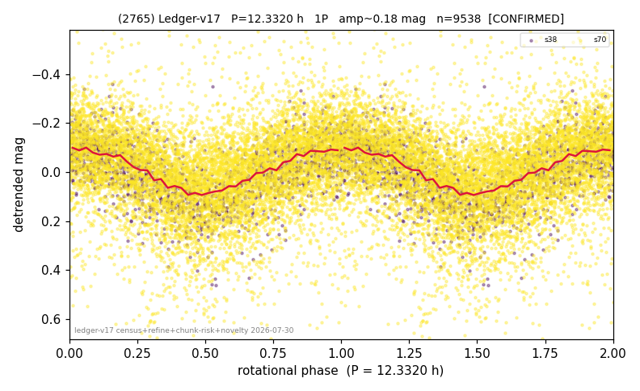

# (2765)

**Adopted:** 12.332 h, 1P, CONFIRMED

<!-- AUTO:START (regenerated from pipeline outputs; do not hand-edit this block) -->
## Evidence (auto)

Detected in 2 sector(s):

| sector | N | baseline (h) | P_phot (h) | power | FAP | cycles | flags |
|--|--|--|--|--|--|--|--|
| s38 | 1593 | 395.5 | 12.3283 | 0.3957 | 1.3e-169 | 32.1 | 2P-ambiguous |
| s70 | 8045 | 600.8 | 12.336 | 0.1585 | 2.8e-296 | 48.7 | star-cleaned:144,2P-ambiguous |

- Pipeline refine said: **1P** (folded amp_fourier 0.228); flags: sick-dips-excised:s70(57)
- DIA (de-comb): survived(dPW=+0%,R2=0.00,s38@12.332h,2sec)
- Coverage: **2 sector(s)**, best sector covers **48.72 cycles** of the adopted period. Measured periodogram peak width 2% of the period, i.e. about **+/- 0.1 h** (1 sigma); the decimal places in the adopted value are not a precision claim.
- Factor of two: no doubling was applied.
- Gates: FAP<1e-3 and power>=0.10 per detecting sector; >=2 sectors agree (harmonic-aware).
- Adopted shape: **1P** (folded-amplitude rule; pipeline agrees).

### Why this row reads the way it does

- 2 sector(s) detecting
- cross-sector fold correlation 0.95
- single-peaked at folded amp 0.228 mag

<!-- AUTO:END -->
