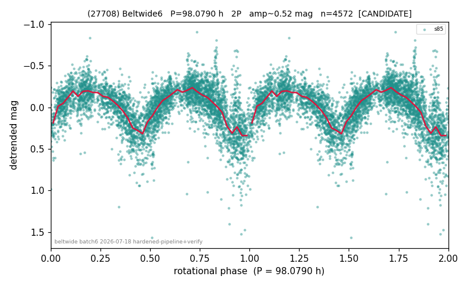

# (27708)

**Adopted:** 98.079 h, 2P, CANDIDATE

<!-- AUTO:START (regenerated from pipeline outputs; do not hand-edit this block) -->
## Evidence (auto)

Detected in 1 sector(s):

| sector | N | baseline (h) | P_phot (h) | power | FAP | cycles | flags |
|--|--|--|--|--|--|--|--|
| s85 | 4572 | 338.6 | 49.0395 | 0.3977 | 0.0e+00 | 6.9 | 2P-ambiguous |

- Pipeline refine said: **2P** (folded amp_fourier 0.501); flags: few-cycle:3.5;sick-dips-excised:s85(10)
- DIA (de-comb): survived(dPW=+4%,R2=0.02,s85@49.039h,2sec)
- Gates: FAP<1e-3 and power>=0.10 per detecting sector; single strong sector (candidate ceiling).
- Adopted shape: **2P** (folded-amplitude rule; pipeline agrees).

### Why this row reads the way it does

- REVIEW-FLAG: folded_amp=0.55. Single-sector (s85) LS detects P_phot=49.04h strongly (power=0.40, FAP~0); folded amplitude at fold (Fourier K=2 + binned-ridge, post sick-dip excision) is 0.50-0.57, well above the 0.40 threshold so 2P/98.079h

<!-- AUTO:END -->
