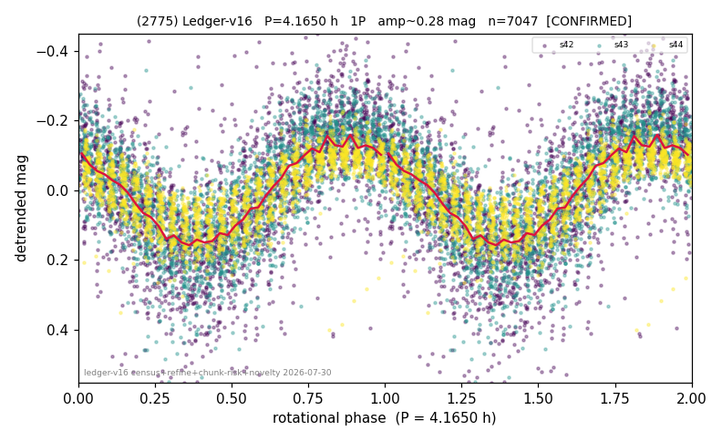

# (2775)

**Adopted:** 8.33 h, 2P, CONFIRMED

<!-- AUTO:START (regenerated from pipeline outputs; do not hand-edit this block) -->
## Evidence (auto)

Detected in 3 sector(s):

| sector | N | baseline (h) | P_phot (h) | power | FAP | cycles | flags |
|--|--|--|--|--|--|--|--|
| s42 | 2275 | 474.7 | 4.1652 | 0.4594 | 6.0e-299 | 57.0 | clean |
| s43 | 2686 | 582.9 | 4.165 | 0.5968 | 0.0e+00 | 70.0 | clean |
| s44 | 2120 | 573.9 | 4.164 | 0.6834 | 0.0e+00 | 68.9 | clean |

- Pipeline refine said: **1P** (folded amp_fourier 0.398); flags: amp-from-clean-sectors(ignored s42);sick-dips-excised:s42(14),s43(1),s44(5);near-threshold
- DIA (de-comb): survived(dPW=+9%,R2=0.21,s43@4.165h,5sec)
- Coverage: **3 sector(s)**, best sector covers **69.97 cycles** of the adopted period. Measured periodogram peak width 1% of the period, i.e. about **+/- 0.01022 h** (1 sigma); the decimal places in the adopted value are not a precision claim.
- Factor of two: **measured on the data** (odd-harmonic power or unequal minima, significant and reproduced), METHODOLOGY 3b.
- Gates: FAP<1e-3 and power>=0.10 per detecting sector; >=2 sectors agree (harmonic-aware).
- **Adopted shape 2P OVERRIDES the pipeline's 1P** (doubling audit 2026-07-25: folded amplitude >= 0.25 mag, so a single-peaked curve is physically implausible; Harris convention -> 2P. The census 3-test doubling logic was measured at only 30% recall against 289 LCDB U>=2 ground-truth periods).

### Why this row reads the way it does

- 3 sector(s) detecting
- cross-sector fold correlation 0.97
- single-peaked at folded amp 0.398 mag
- CORRECTED 4.165->8.3300 h (2026-08-02 full 1P re-audit): doubling MEASURED at odd-harmonic 15.2 sigma with ALL detecting sectors significant (3/3); threshold odd>=8+full-reproduction calibrated to 0/60 false fires on the 4P null test (the minima-asymmetry branch alone fired falsely at z up to 34 and is not accepted)

<!-- AUTO:END -->
