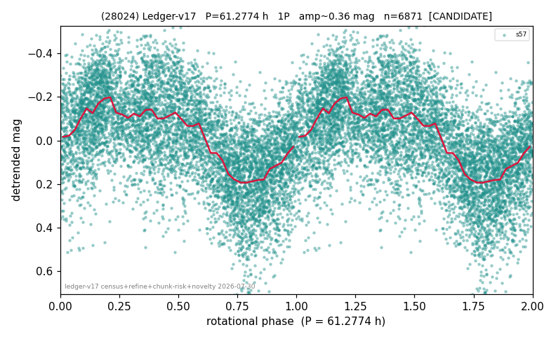

# (28024)

**Adopted:** 61.2774 h, 1P, CANDIDATE

<!-- AUTO:START (regenerated from pipeline outputs; do not hand-edit this block) -->
## Evidence (auto)

Detected in 1 sector(s):

| sector | N | baseline (h) | P_phot (h) | power | FAP | cycles | flags |
|--|--|--|--|--|--|--|--|
| s57 | 6942 | 549.5 | 61.2774 | 0.3218 | 0.0e+00 | 9.0 | 2P-ambiguous |

- Pipeline refine said: **1P** (folded amp_fourier 0.372); flags: gap-alias-risk:77h;sick-dips-excised:s57(1);near-threshold:0.37
- DIA (de-comb): survived(dPW=+2%,R2=0.00,s57@61.277h,2sec)
- Coverage: **1 sector(s)**, best sector covers **8.97 cycles** of the adopted period. Measured periodogram peak width 11% of the period, i.e. about **+/- 2.883 h** (1 sigma); the decimal places in the adopted value are not a precision claim.
- Factor of two: no doubling was applied.
- Gates: FAP<1e-3 and power>=0.10 per detecting sector; single strong sector (candidate ceiling).
- Adopted shape: **1P** (folded-amplitude rule; pipeline agrees).

### Why this row reads the way it does

- 1 sector(s) detecting
- single-peaked at folded amp 0.372 mag

<!-- AUTO:END -->
