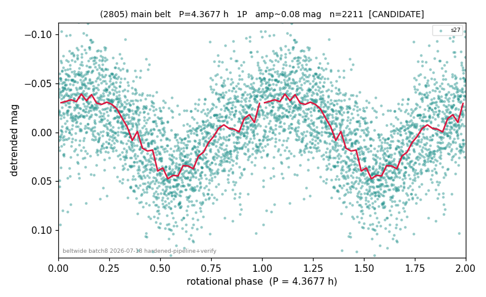

# (2805)

**Adopted:** 4.3677 h, 1P, CANDIDATE

<!-- AUTO:START (regenerated from pipeline outputs; do not hand-edit this block) -->
## Evidence (auto)

Detected in 1 sector(s):

| sector | N | baseline (h) | P_phot (h) | power | FAP | cycles | flags |
|--|--|--|--|--|--|--|--|
| s27 | 2215 | 463.7 | 4.3677 | 0.3401 | 2.9e-195 | 106.2 | 2P-ambiguous |

- Refined shape: **1P** (folded amp_fourier 0.097); flags: sick-dips-excised:s27(2)
- DIA (de-comb): survived(dPW=-8%,R2=0.74,s27@4.368h,2sec)
- Gates: FAP<1e-3 and power>=0.10 per detecting sector; single strong sector (candidate ceiling); folded-amplitude rule -> 1P.

<!-- AUTO:END -->
