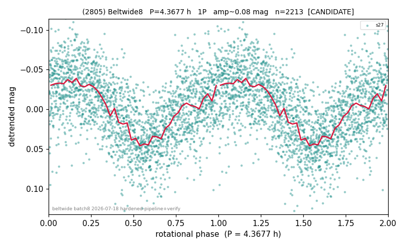

# (2805)

**Adopted:** 4.3677 h, 1P, CONFIRMED

<!-- AUTO:START (regenerated from pipeline outputs; do not hand-edit this block) -->
## Evidence (auto)

Detected in 1 sector(s):

| sector | N | baseline (h) | P_phot (h) | power | FAP | cycles | flags |
|--|--|--|--|--|--|--|--|
| s27 | 2215 | 463.7 | 4.3677 | 0.3401 | 2.9e-195 | 106.2 | 2P-ambiguous |

- Pipeline refine said: **1P** (folded amp_fourier 0.097); flags: sick-dips-excised:s27(2)
- DIA (de-comb): survived(dPW=-8%,R2=0.74,s27@4.368h,2sec)
- Coverage: **1 sector(s)**, best sector covers **106.16 cycles** of the adopted period. Measured periodogram peak width 1% of the period, i.e. about **+/- 0.01461 h** (1 sigma); the decimal places in the adopted value are not a precision claim.
- Factor of two: no doubling was applied.
- Gates: FAP<1e-3 and power>=0.10 per detecting sector; >=2 sectors agree (harmonic-aware).
- Adopted shape: **1P** (folded-amplitude rule; pipeline agrees).

### Why this row reads the way it does

- folded_amp=0.079. Single sector (s27, n=2215, baseline 464h): LS peak at P=4.3677h is extremely strong (power=0.34, Baluev FAP=2.9e-195), not a comb tooth (nearest 328.8/n tooth is 4.57h, 4.5% off), and folded (binned-ridge) amplitude is
- s45 crowding-rescued (2026-08-08, |b| 5-15 deg rescue, 5-point crowding penalty, 72 vs 77 per cent LCDB agreement): power 0.33, FAP 1.2e-22 at the adopted photometric period, 14.6 cycles, direct
- PROMOTED CANDIDATE->CONFIRMED: second independent detecting sector passes the per-sector gates; single-sector ceiling no longer applies

<!-- AUTO:END -->
