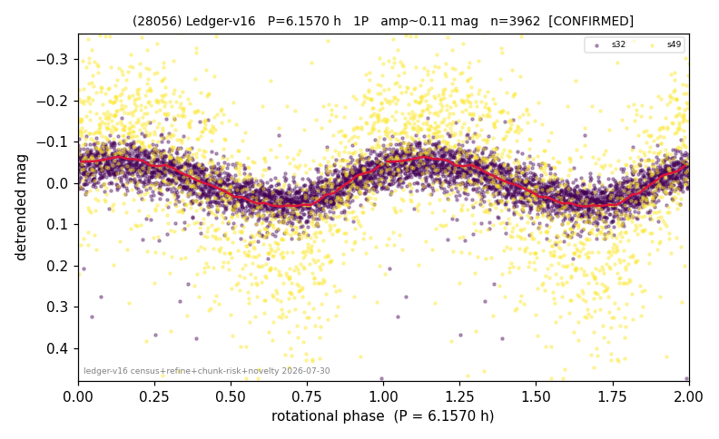

# (28056)

**Adopted:** 6.157 h, 1P, CONFIRMED

<!-- AUTO:START (regenerated from pipeline outputs; do not hand-edit this block) -->
## Evidence (auto)

Detected in 2 sector(s):

| sector | N | baseline (h) | P_phot (h) | power | FAP | cycles | flags |
|--|--|--|--|--|--|--|--|
| s32 | 2559 | 554.3 | 6.1565 | 0.3675 | 1.0e-249 | 90.0 | star-cleaned:17 |
| s49 | 1422 | 268.2 | 6.1571 | 0.3757 | 5.1e-141 | 43.6 | star-cleaned:2,2P-ambiguous |

- Pipeline refine said: **1P** (folded amp_fourier 0.114); flags: amp-from-clean-sectors(ignored s49);sick-dips-excised:s32(5),s49(6)
- DIA (de-comb): survived(dPW=+4%,R2=0.05,s49@6.157h,3sec)
- Coverage: **2 sector(s)**, best sector covers **90.03 cycles** of the adopted period. Measured periodogram peak width 1% of the period, i.e. about **+/- 0.02746 h** (1 sigma); the decimal places in the adopted value are not a precision claim.
- Factor of two: no doubling was applied.
- Gates: FAP<1e-3 and power>=0.10 per detecting sector; >=2 sectors agree (harmonic-aware).
- Adopted shape: **1P** (folded-amplitude rule; pipeline agrees).

### Why this row reads the way it does

- 2 sector(s) detecting
- cross-sector fold correlation 0.95
- single-peaked at folded amp 0.114 mag

<!-- AUTO:END -->
