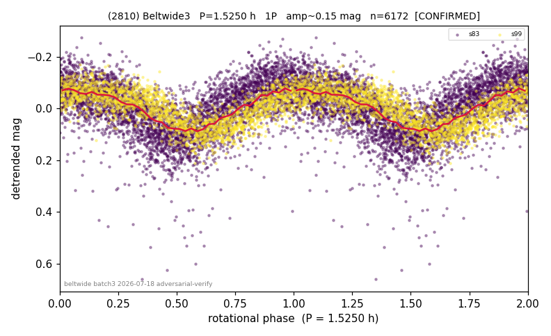

# (2810)

**Adopted:** 1.525 h, 1P, CONFIRMED

<!-- AUTO:START (regenerated from pipeline outputs; do not hand-edit this block) -->
## Evidence (auto)

Detected in 2 sector(s):

| sector | N | baseline (h) | P_phot (h) | power | FAP | cycles | flags |
|--|--|--|--|--|--|--|--|
| s83 | 4239 | 300.7 | 1.5236 | 0.4523 | 0.0e+00 | 197.3 | 2P-ambiguous |
| s99 | 1933 | 126.4 | 1.5242 | 0.6002 | 0.0e+00 | 82.9 | clean |

- Refined shape: **1P** (folded amp_fourier 0.198); flags: clean
- DIA (de-comb): not triggered (clean, fast, non-comb)
- Gates: FAP<1e-3 and power>=0.10 per detecting sector; >=2 sectors agree (harmonic-aware); folded-amplitude rule -> 1P.

<!-- AUTO:END -->
