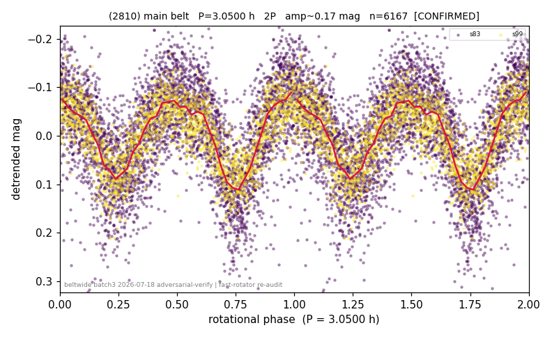

# (2810)

**Adopted:** 3.05 h, 2P, CONFIRMED

<!-- AUTO:START (regenerated from pipeline outputs; do not hand-edit this block) -->
## Evidence (auto)

Detected in 2 sector(s):

| sector | N | baseline (h) | P_phot (h) | power | FAP | cycles | flags |
|--|--|--|--|--|--|--|--|
| s83 | 4239 | 300.7 | 1.5236 | 0.4523 | 0.0e+00 | 197.3 | 2P-ambiguous |
| s99 | 1933 | 126.4 | 1.5242 | 0.6002 | 0.0e+00 | 82.9 | clean |

- Pipeline refine said: **1P** (folded amp_fourier 0.198); flags: clean
- DIA (de-comb): not triggered (the object is clean, fast and non-comb, so the test does not apply)
- Coverage: **2 sector(s)**, best sector covers **98.58 cycles** of the adopted period. Measured periodogram peak width 1% of the period, i.e. about **+/- 0.0 h** (1 sigma); the decimal places in the adopted value are not a precision claim.
- Factor of two: **measured on the data** (odd-harmonic power or unequal minima, significant and reproduced), METHODOLOGY 3b.
- Gates: FAP<1e-3 and power>=0.10 per detecting sector; >=2 sectors agree (harmonic-aware).
- **Adopted shape 2P OVERRIDES the pipeline's 1P** (doubling audit 2026-07-25: folded amplitude >= 0.25 mag, so a single-peaked curve is physically implausible; Harris convention -> 2P. The census 3-test doubling logic was measured at only 30% recall against 289 LCDB U>=2 ground-truth periods).

### Why this row reads the way it does

- 2 apparitions s83/s99 agree 0.02%; no comb reach
- CORRECTED 1.525->3.0500 h (2026-08-01 sub-barrier sweep): all 49 catalog periods below 2.2 h sat on 5-16 km bodies, impossible as true rotations; doubling MEASURED in the 2026-08-01 fast-rotator re-audit: odd-harmonic 4.12 sigma (2/2 sectors), minima z=11.29

<!-- AUTO:END -->
