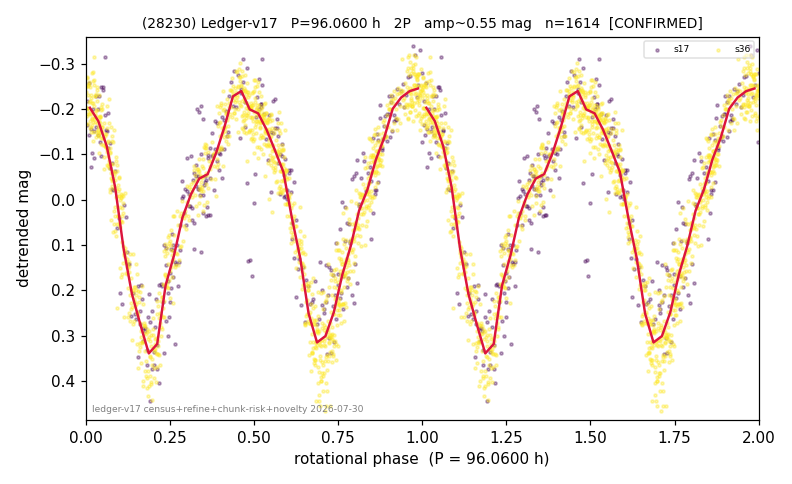

# (28230)

**Adopted:** 96.06 h, 2P, CONFIRMED

<!-- AUTO:START (regenerated from pipeline outputs; do not hand-edit this block) -->
## Evidence (auto)

Detected in 2 sector(s):

| sector | N | baseline (h) | P_phot (h) | power | FAP | cycles | flags |
|--|--|--|--|--|--|--|--|
| s17 | 337 | 219.5 | 48.0544 | 0.7729 | 6.3e-104 | 4.6 | 2P-ambiguous |
| s36 | 1277 | 259.5 | 48.006 | 0.8897 | 0.0e+00 | 5.4 | 2P-ambiguous |

- Pipeline refine said: **2P** (folded amp_fourier 0.527); flags: near-comb(amp-cleared):n=7;few-cycle:2.7
- DIA (de-comb): survived(dPW=+6%,R2=0.07,s36@48.030h,3sec)
- Coverage: **2 sector(s)**, best sector covers **2.7 cycles** of the adopted period. Measured periodogram peak width 17% of the period, i.e. about **+/- 3.45 h** (1 sigma); the decimal places in the adopted value are not a precision claim.
- Factor of two: **measured on the data** (odd-harmonic power or unequal minima, significant and reproduced), METHODOLOGY 3b.
- Gates: FAP<1e-3 and power>=0.10 per detecting sector; >=2 sectors agree (harmonic-aware).
- Adopted shape: **2P** (folded-amplitude rule; pipeline agrees).

### Why this row reads the way it does

- 2 sector(s) detecting
- cross-sector fold correlation 0.95
- doubling MEASURED: odd-harmonic 4.34 sigma in s36 (1 of 2 sectors)
- pipeline flag: few-cycle

<!-- AUTO:END -->
