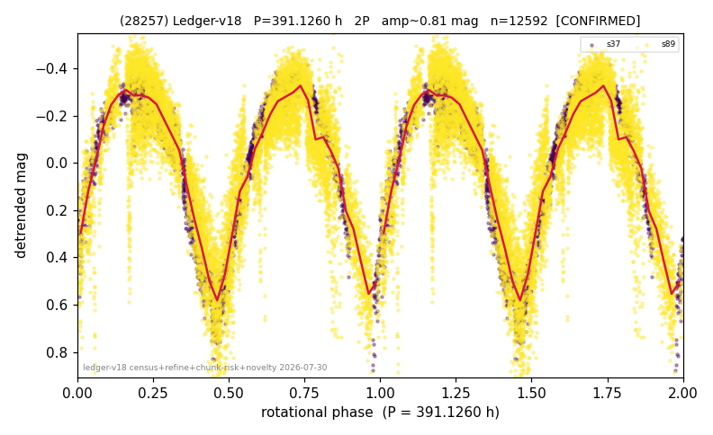

# (28257)

**Adopted:** 391.126 h, 2P, CONFIRMED

<!-- AUTO:START (regenerated from pipeline outputs; do not hand-edit this block) -->
## Evidence (auto)

Detected in 2 sector(s):

| sector | N | baseline (h) | P_phot (h) | power | FAP | cycles | flags |
|--|--|--|--|--|--|--|--|
| s37 | 2975 | 595.7 | 197.2873 | 0.8811 | 0.0e+00 | 3.0 | 2P-untestable,2P-ambiguous |
| s89 | 9643 | 668.7 | 193.8388 | 0.7214 | 0.0e+00 | 3.4 | star-cleaned:13,2P-untestable,2P-ambiguo |

- Pipeline refine said: **2P** (folded amp_fourier 0.846); flags: few-cycle:1.7;sick-dips-excised:s37(2),s89(24)
- DIA (de-comb): survived(dPW=+0%,R2=0.09,s37@195.563h,6sec)
- Coverage: **2 sector(s)**, best sector covers **1.71 cycles** of the adopted period. Measured periodogram peak width 29% of the period, i.e. about **+/- 24.38 h** (1 sigma); the decimal places in the adopted value are not a precision claim.
- Factor of two: **measured on the data** (odd-harmonic power or unequal minima, significant and reproduced), METHODOLOGY 3b.
- Gates: FAP<1e-3 and power>=0.10 per detecting sector; >=2 sectors agree (harmonic-aware).
- Adopted shape: **2P** (folded-amplitude rule; pipeline agrees).

### Why this row reads the way it does

- 2 sector(s) detecting
- cross-sector fold correlation 0.98
- doubling MEASURED: odd-harmonic 3.08 sigma in s37 only; s89 shows nothing (asym z=-0.7), so 391.13 h rests on one sector of two
- chunked sectors flagged (SUPPRESSED;direct-sector-supported) but a directly extracted sector carries the period
- pipeline flag: few-cycle

<!-- AUTO:END -->
