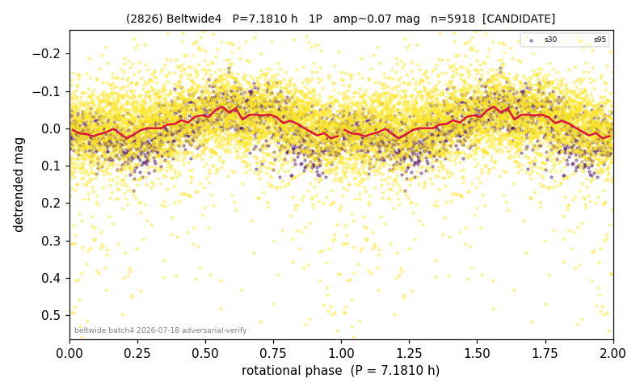

# (2826)

**Adopted:** 7.181 h, 1P, CANDIDATE

<!-- AUTO:START (regenerated from pipeline outputs; do not hand-edit this block) -->
## Evidence (auto)

Detected in 2 sector(s):

| sector | N | baseline (h) | P_phot (h) | power | FAP | cycles | flags |
|--|--|--|--|--|--|--|--|
| s30 | 1384 | 366.3 | 7.1818 | 0.3334 | 1.4e-117 | 51.0 | 2P-ambiguous |
| s95 | 4587 | 353.4 | 7.2094 | 0.0671 | 1.2e-64 | 49.0 | star-cleaned:141 |

- Pipeline refine said: **1P** (folded amp_fourier 0.108); flags: clean
- DIA (de-comb): not triggered (clean, fast, non-comb)
- Gates: FAP<1e-3 and power>=0.10 per detecting sector; single strong sector (candidate ceiling).
- Adopted shape: **1P** (folded-amplitude rule; pipeline agrees).

### Why this row reads the way it does

- S30 (n=1384, baseline 366.3h) gives a clean, dominant error-weighted LS detection at P=7.1815h, power=0.333, FAP=1.4e-117, 88x above the local noise f

<!-- AUTO:END -->
