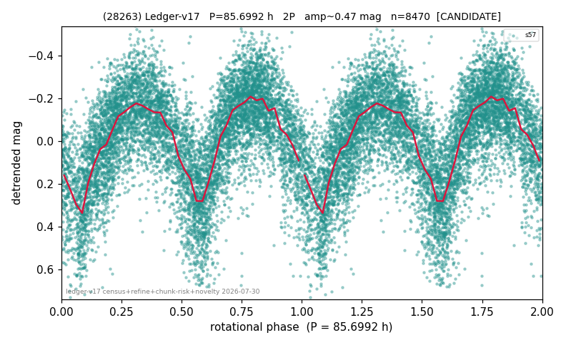

# (28263)

**Adopted:** 85.6992 h, 2P, CANDIDATE

<!-- AUTO:START (regenerated from pipeline outputs; do not hand-edit this block) -->
## Evidence (auto)

Detected in 1 sector(s):

| sector | N | baseline (h) | P_phot (h) | power | FAP | cycles | flags |
|--|--|--|--|--|--|--|--|
| s57 | 8519 | 672.9 | 42.8496 | 0.4352 | 0.0e+00 | 15.7 | star-cleaned:15,2P-ambiguous |

- Pipeline refine said: **2P** (folded amp_fourier 0.48); flags: gap-alias-risk:76h;sick-dips-excised:s57(3)
- DIA (de-comb): not triggered (clean, fast, non-comb)
- Gates: FAP<1e-3 and power>=0.10 per detecting sector; single strong sector (candidate ceiling).
- Adopted shape: **2P** (folded-amplitude rule; pipeline agrees).

### Why this row reads the way it does

- 1 sector(s) detecting
- doubling BY CONVENTION: amplitude rule on folded amp 0.480 mag, not individually audited

<!-- AUTO:END -->
