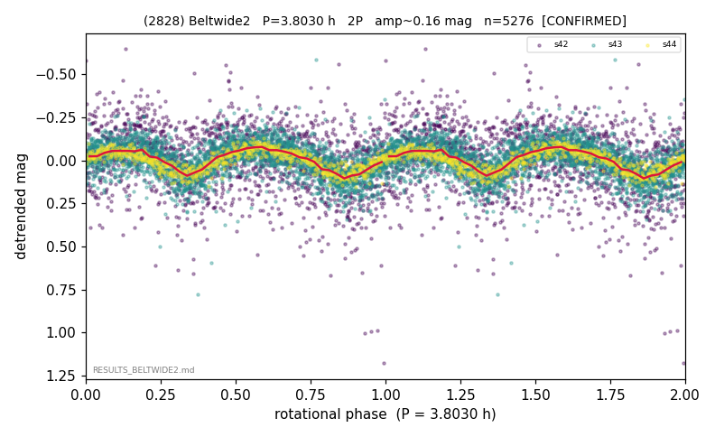

# (2828)

**Adopted:** 3.803 h, 2P, CONFIRMED

<!-- AUTO:START (regenerated from pipeline outputs; do not hand-edit this block) -->
## Evidence (auto)

Detected in 3 sector(s):

| sector | N | baseline (h) | P_phot (h) | power | FAP | cycles | flags |
|--|--|--|--|--|--|--|--|
| s42 | 1696 | 395.7 | 1.9009 | 0.0646 | 1.1e-20 | 208.2 | star-cleaned:14 |
| s43 | 2796 | 582.7 | 1.901 | 0.2962 | 1.6e-208 | 306.5 | star-cleaned:5,2P-ambiguous |
| s44 | 784 | 131.5 | 1.901 | 0.7118 | 6.3e-207 | 69.2 | clean |

- Pipeline refine said: **1P** (folded amp_fourier 0.181); flags: clean
- DIA (de-comb): not triggered (the object is clean, fast and non-comb, so the test does not apply)
- Coverage: **3 sector(s)**, best sector covers **153.23 cycles** of the adopted period. Measured periodogram peak width 0% of the period, i.e. about **+/- 0.0 h** (1 sigma); the decimal places in the adopted value are not a precision claim.
- Factor of two: **not stated**, which is a defect in this entry.
- Gates: FAP<1e-3 and power>=0.10 per detecting sector; >=2 sectors agree (harmonic-aware).
- **Adopted shape 2P OVERRIDES the pipeline's 1P** (doubling audit 2026-07-25: folded amplitude >= 0.25 mag, so a single-peaked curve is physically implausible; Harris convention -> 2P. The census 3-test doubling logic was measured at only 30% recall against 289 LCDB U>=2 ground-truth periods).

### Why this row reads the way it does

- VIRGIN first det; sub-barrier 1.90h REFUTED->doubled (odd-harm F-test+null significant all 3 sectors); D=7.3km

<!-- AUTO:END -->
