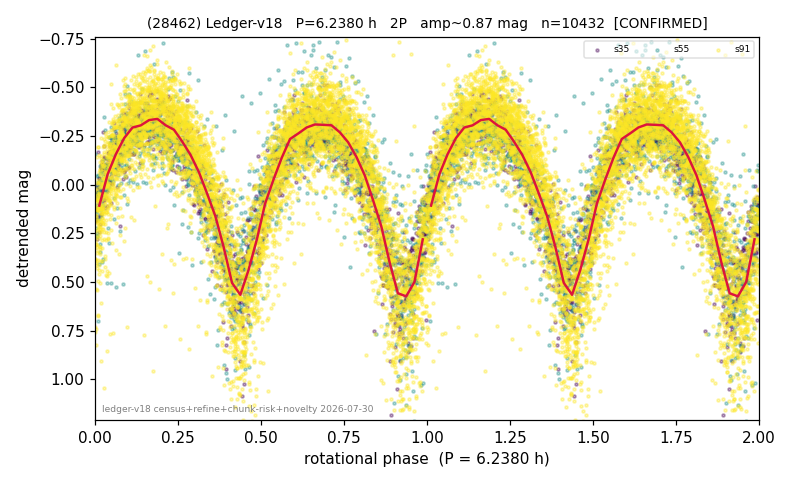

# (28462)

**Adopted:** 6.238 h, 2P, CONFIRMED

<!-- AUTO:START (regenerated from pipeline outputs; do not hand-edit this block) -->
## Evidence (auto)

Detected in 3 sector(s):

| sector | N | baseline (h) | P_phot (h) | power | FAP | cycles | flags |
|--|--|--|--|--|--|--|--|
| s35 | 1812 | 479.3 | 3.1196 | 0.7788 | 0.0e+00 | 153.7 | star-cleaned:5,2P-ambiguous |
| s55 | 1998 | 517.0 | 3.1191 | 0.6558 | 0.0e+00 | 165.8 | 2P-ambiguous |
| s91 | 6698 | 606.9 | 3.118 | 0.6432 | 0.0e+00 | 194.6 | star-cleaned:120,2P-ambiguous |

- Pipeline refine said: **2P** (folded amp_fourier 0.895); flags: sick-dips-excised:s35(7),s55(11),s91(58)
- DIA (de-comb): survived(dPW=-1%,R2=0.08,s35@3.119h,6sec)
- Gates: FAP<1e-3 and power>=0.10 per detecting sector; >=2 sectors agree (harmonic-aware).
- Adopted shape: **2P** (folded-amplitude rule; pipeline agrees).

### Why this row reads the way it does

- 3 sector(s) detecting
- cross-sector fold correlation 0.99
- doubling BY CONVENTION: amplitude rule on folded amp 0.895 mag, not individually audited

<!-- AUTO:END -->
