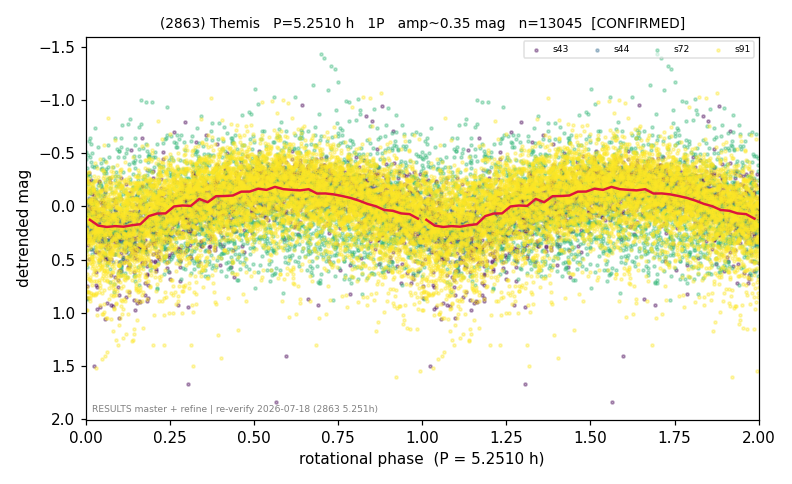

# (2863)

**Adopted:** 5.251 h, 1P, CONFIRMED

<!-- AUTO:START (regenerated from pipeline outputs; do not hand-edit this block) -->
## Evidence (auto)

Detected in 4 sector(s):

| sector | N | baseline (h) | P_phot (h) | power | FAP | cycles | flags |
|--|--|--|--|--|--|--|--|
| s43 | 2050 | 581.9 | 5.2507 | 0.2779 | 2.5e-140 | 55.4 | star-cleaned:5 |
| s44 | 1342 | 244.8 | 5.2466 | 0.6772 | 0.0e+00 | 46.7 | 2P-ambiguous |
| s72 | 2240 | 393.3 | 164.3251 | 0.12 | 5.2e-58 | 2.4 | star-cleaned:4,phase-curve-risk,2P-untes |
| s91 | 7413 | 601.1 | 5.2506 | 0.1698 | 2.0e-294 | 114.5 | star-cleaned:96,2P-ambiguous |

- Refined shape: **2P** (folded amp_fourier 0.519); flags: sick-dips-excised:s43(3),s91(6);harmonic-only-agreement:s72(pw=0.00);incoherent-sectors:3/
- DIA (de-comb): survived(dPW=+1%,R2=0.13,s44@5.251h,6sec)
- Gates: FAP<1e-3 and power>=0.10 per detecting sector; >=2 sectors agree (harmonic-aware); folded-amplitude rule -> 1P.

<!-- AUTO:END -->

## Reasoning
Prior 10.501 h was a comb-alias artifact from the contaminated s72 (164.4 h = 328.8/2). 3 clean sectors s43/s44/s91 agree 5.251 h (FAP 1e-140..1e-294). Same failure mode as 3127 but with clean sectors that recover the real period.
## Verdict
CORRECTED to CONFIRMED 1P / 5.251 h.
