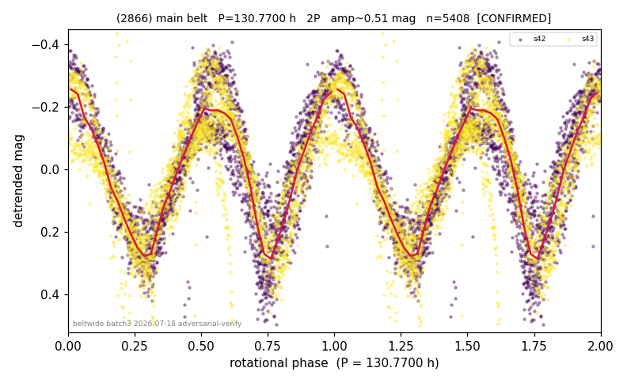

# (2866)

**Adopted:** 130.77 h, 2P, CONFIRMED

<!-- AUTO:START (regenerated from pipeline outputs; do not hand-edit this block) -->
## Evidence (auto)

Detected in 2 sector(s):

| sector | N | baseline (h) | P_phot (h) | power | FAP | cycles | flags |
|--|--|--|--|--|--|--|--|
| s42 | 2643 | 593.7 | 65.3945 | 0.7422 | 0.0e+00 | 9.1 | star-cleaned:17,2P-ambiguous |
| s43 | 2786 | 593.2 | 65.3762 | 0.7031 | 0.0e+00 | 9.1 | 2P-ambiguous |

- Gates: FAP<1e-3 and power>=0.10 per detecting sector; >=2 sectors agree (harmonic-aware); folded-amplitude rule -> 2P.

<!-- AUTO:END -->
