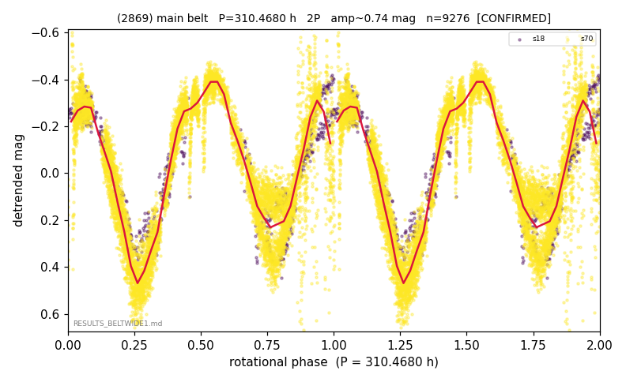

# (2869)

**Adopted:** 310.468 h, 2P, CONFIRMED

<!-- AUTO:START (regenerated from pipeline outputs; do not hand-edit this block) -->
## Evidence (auto)

Detected in 2 sector(s):

| sector | N | baseline (h) | P_phot (h) | power | FAP | cycles | flags |
|--|--|--|--|--|--|--|--|
| s18 | 664 | 562.0 | 154.6012 | 0.8837 | 1.3e-304 | 3.6 | 2P-untestable,2P-ambiguous |
| s70 | 8643 | 600.9 | 155.8666 | 0.8191 | 0.0e+00 | 3.9 | 2P-untestable,2P-ambiguous |

- Refined shape: **2P** (folded amp_fourier 0.645); flags: few-cycle:1.8;gap-alias-risk:84h;sector-dropped:s70(range>3mag)
- DIA (de-comb): inconclusive(dPW=+21%,R2=0.26,s18@155.234h)
- Gates: FAP<1e-3 and power>=0.10 per detecting sector; >=2 sectors agree (harmonic-aware); folded-amplitude rule -> 2P.

<!-- AUTO:END -->
