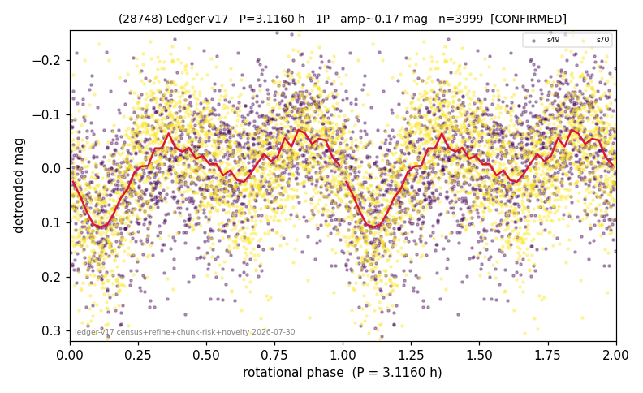

# (28748)

**Adopted:** 3.116 h, 1P, CONFIRMED

<!-- AUTO:START (regenerated from pipeline outputs; do not hand-edit this block) -->
## Evidence (auto)

Detected in 2 sector(s):

| sector | N | baseline (h) | P_phot (h) | power | FAP | cycles | flags |
|--|--|--|--|--|--|--|--|
| s49 | 1782 | 460.8 | 3.1158 | 0.1041 | 1.8e-38 | 147.9 | 2P-ambiguous |
| s70 | 2218 | 129.0 | 1.5583 | 0.2549 | 3.3e-137 | 41.4 | clean |

- Pipeline refine said: **1P** (folded amp_fourier 0.091); flags: harmonic-only-agreement:s70(pw=0.04);period-spread:67%
- DIA (de-comb): not triggered (the object is clean, fast and non-comb, so the test does not apply)
- Coverage: **2 sector(s)**, best sector covers **147.89 cycles** of the adopted period. Measured periodogram peak width 1% of the period, i.e. about **+/- 0.01 h** (1 sigma); the decimal places in the adopted value are not a precision claim.
- Factor of two: no doubling was applied.
- Gates: FAP<1e-3 and power>=0.10 per detecting sector; >=2 sectors agree (harmonic-aware).
- Adopted shape: **1P** (folded-amplitude rule; pipeline agrees).

### Why this row reads the way it does

- 2 sector(s) detecting
- cross-sector fold correlation 0.70
- single-peaked at folded amp 0.091 mag
- pipeline flag: harmonic-only-agreement

<!-- AUTO:END -->
