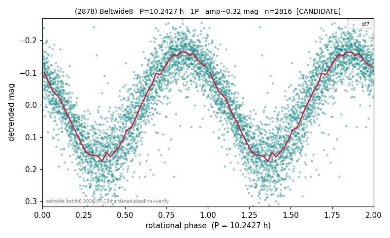

# (2878)

**Adopted:** 20.4854 h, 2P, CANDIDATE

<!-- AUTO:START (regenerated from pipeline outputs; do not hand-edit this block) -->
## Evidence (auto)

Detected in 1 sector(s):

| sector | N | baseline (h) | P_phot (h) | power | FAP | cycles | flags |
|--|--|--|--|--|--|--|--|
| s37 | 2816 | 602.5 | 10.2427 | 0.7913 | 0.0e+00 | 29.4 | clean |

- Pipeline refine said: **1P** (folded amp_fourier 0.375); flags: near-threshold:0.37
- DIA (de-comb): not triggered (the object is clean, fast and non-comb, so the test does not apply)
- Gates: FAP<1e-3 and power>=0.10 per detecting sector; single strong sector (candidate ceiling).
- **Adopted shape 2P OVERRIDES the pipeline's 1P** (doubling audit 2026-07-25: folded amplitude >= 0.25 mag, so a single-peaked curve is physically implausible; Harris convention -> 2P. The census 3-test doubling logic was measured at only 30% recall against 289 LCDB U>=2 ground-truth periods).

### Why this row reads the way it does

- folded_amp=0.34. Single-sector (s37, 25d baseline, 2816 pts, n_clip=0) LS periodogram gives an overwhelming peak at P=10.2423h (power=0.79, FAP~0) vs the 2x alias at 20.56h (power=0.03, FAP~1.5e-15) — a 26x power ratio confirming 10.2427
- CORRECTED 10.2427->20.4854 h (2026-08-02 full 1P re-audit): doubling MEASURED at odd-harmonic 13.2 sigma with ALL detecting sectors significant (1/1); threshold odd>=8+full-reproduction calibrated to 0/60 false fires on the 4P null test (the minima-asymmetry branch alone fired falsely at z up to 34 and is not accepted)

<!-- AUTO:END -->
