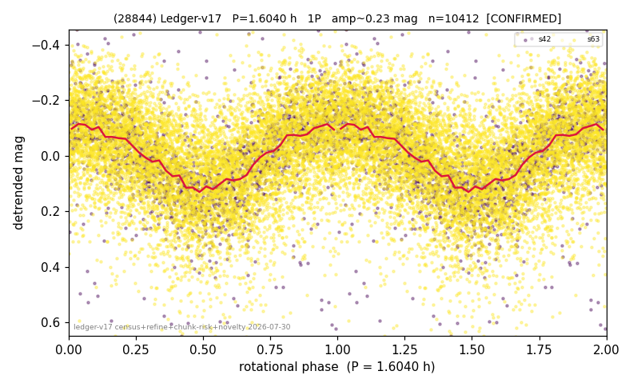

# (28844)

**Adopted:** 1.604 h, 1P, CONFIRMED

<!-- AUTO:START (regenerated from pipeline outputs; do not hand-edit this block) -->
## Evidence (auto)

Detected in 2 sector(s):

| sector | N | baseline (h) | P_phot (h) | power | FAP | cycles | flags |
|--|--|--|--|--|--|--|--|
| s42 | 1985 | 589.9 | 1.6051 | 0.3605 | 4.8e-188 | 367.5 | star-cleaned:18,2P-ambiguous |
| s63 | 8466 | 608.9 | 1.6035 | 0.1845 | 0.0e+00 | 379.7 | star-cleaned:105,2P-ambiguous |

- Pipeline refine said: **1P** (folded amp_fourier 0.267); flags: sick-dips-excised:s42(6),s63(21)
- DIA (de-comb): not triggered (clean, fast, non-comb)
- Gates: FAP<1e-3 and power>=0.10 per detecting sector; >=2 sectors agree (harmonic-aware).
- Adopted shape: **1P** (folded-amplitude rule; pipeline agrees).

### Why this row reads the way it does

- 2 sector(s) detecting
- cross-sector fold correlation 0.97
- single-peaked at folded amp 0.267 mag

<!-- AUTO:END -->
