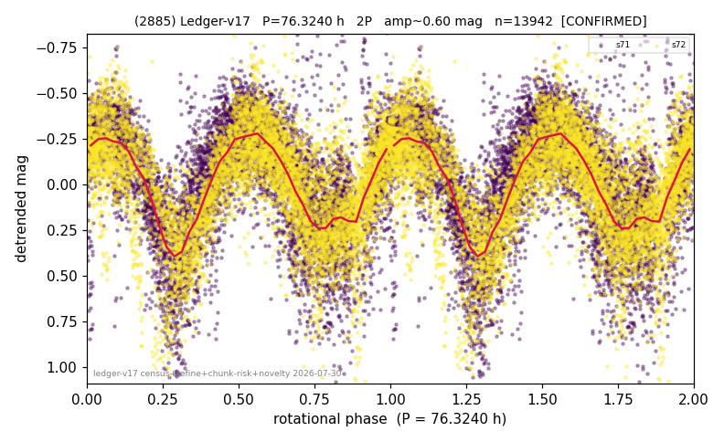

# (2885)

**Adopted:** 76.324 h, 2P, CONFIRMED

<!-- AUTO:START (regenerated from pipeline outputs; do not hand-edit this block) -->
## Evidence (auto)

Detected in 2 sector(s):

| sector | N | baseline (h) | P_phot (h) | power | FAP | cycles | flags |
|--|--|--|--|--|--|--|--|
| s71 | 7280 | 603.5 | 38.1609 | 0.2947 | 0.0e+00 | 7.9 | star-cleaned:62 |
| s72 | 6805 | 601.5 | 38.1629 | 0.5252 | 0.0e+00 | 7.9 | star-cleaned:71 |

- Pipeline refine said: **2P** (folded amp_fourier 0.626); flags: gap-alias-risk:87h;sick-dips-excised:s71(24),s72(42)
- DIA (de-comb): not triggered (clean, fast, non-comb)
- Gates: FAP<1e-3 and power>=0.10 per detecting sector; >=2 sectors agree (harmonic-aware).
- Adopted shape: **2P** (folded-amplitude rule; pipeline agrees).

### Why this row reads the way it does

- 2 sector(s) detecting
- cross-sector fold correlation 0.96
- doubling BY CONVENTION: amplitude rule on folded amp 0.626 mag, not individually audited

<!-- AUTO:END -->
