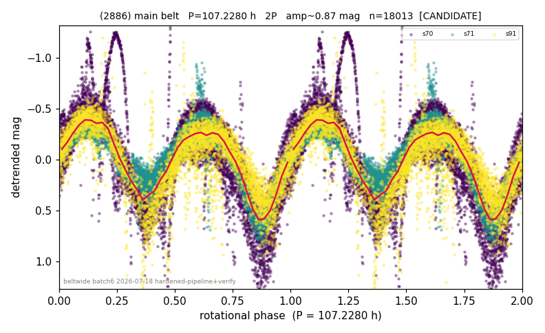

# (2886)

**Adopted:** 107.228 h, 2P, CANDIDATE

<!-- AUTO:START (regenerated from pipeline outputs; do not hand-edit this block) -->
## Evidence (auto)

Detected in 3 sector(s):

| sector | N | baseline (h) | P_phot (h) | power | FAP | cycles | flags |
|--|--|--|--|--|--|--|--|
| s70 | 8137 | 525.8 | 53.6142 | 0.4192 | 0.0e+00 | 4.9 | star-cleaned:150 |
| s71 | 4678 | 461.2 | 53.5308 | 0.7719 | 0.0e+00 | 4.3 | clean |
| s91 | 5312 | 357.9 | 53.7639 | 0.7062 | 0.0e+00 | 3.3 | star-cleaned:80 |

- Pipeline refine said: **2P** (folded amp_fourier 1.199); flags: near-comb(amp-cleared):n=3,6;gap-alias-risk:95h;sick-dips-excised:s70(48),s71(17),s91(49)
- DIA (de-comb): survived(dPW=+7%,R2=0.13,s71@53.614h,8sec)
- Gates: FAP<1e-3 and power>=0.10 per detecting sector; single strong sector (candidate ceiling).
- Adopted shape: **2P** (folded-amplitude rule; pipeline agrees).

### Why this row reads the way it does

- REVIEW-FLAG: folded_amp=0.9. All 3 sectors independently converge on the same 53.6h fundamental (window-function power only 0.01-0.03 vs signal power 0.42-0.77, ruling out the n=3/6 momentum-dump comb), doubling cleanly to 107.2h, and fold

<!-- AUTO:END -->
